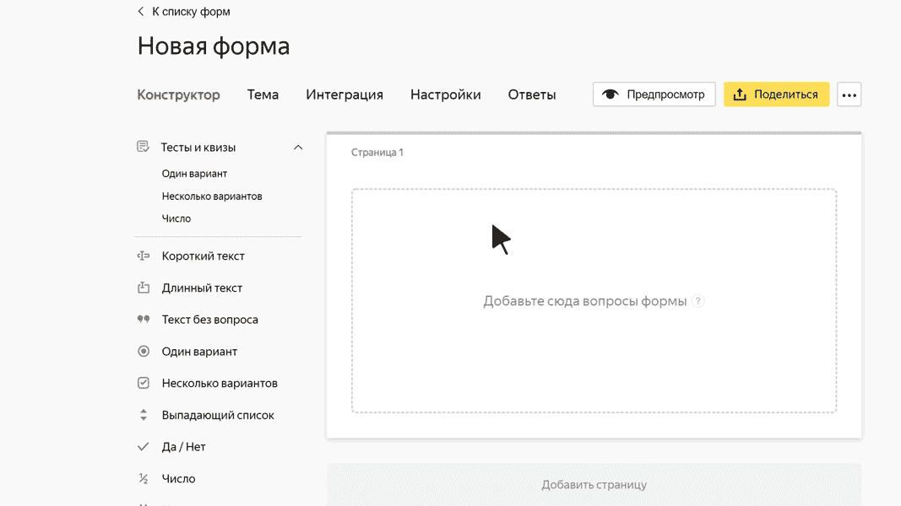

# Блок «Несколько вариантов»

В этом блоке пользователь может выбрать сразу несколько вариантов из списка. Например, выбрать услуги, которые он хочет заказать.

## Настройки блока {#sec_settings}

### Вопрос {#param-question}

Введите формулировку вопроса.









