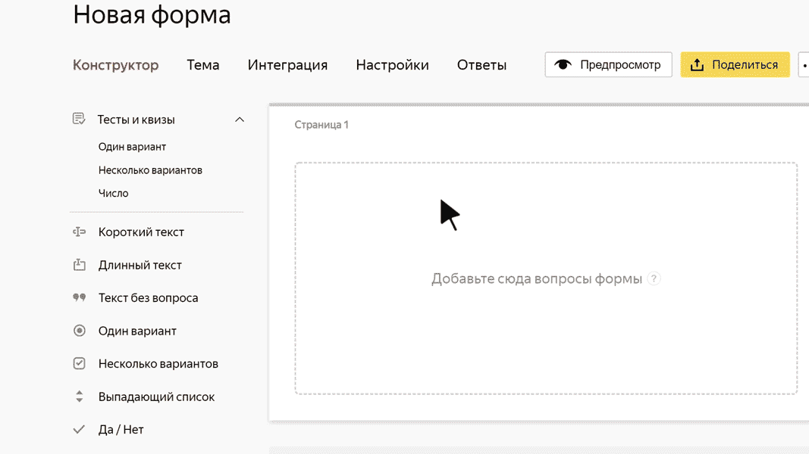

# Текст без вопроса

Этот блок не требует ответа от пользователя. В него можно добавить произвольный текст, например информацию о форме или заголовок для группы вопросов.

## Настройки блока {#sec_settings}

### Текст {#text}

Введите текст, который нужно разместить на форме.
- Чтобы использовать блок как заголовок для группы вопросов, включите опцию **Сделать заголовком**. Заголовок отображается крупным шрифтом и отделяется от предыдущего вопроса горизонтальной линией.

- Чтобы добавить к тексту рисунок, нажмите значок .

- Чтобы добавить к тексту комментарий, нажмите **+ Добавить комментарий**. Текст комментария отображается уменьшенным шрифтом.

- Чтобы форматировать текст или комментарий, используйте [разметку Markdown](../appearance.md#section_pzm_m1j_j3b).