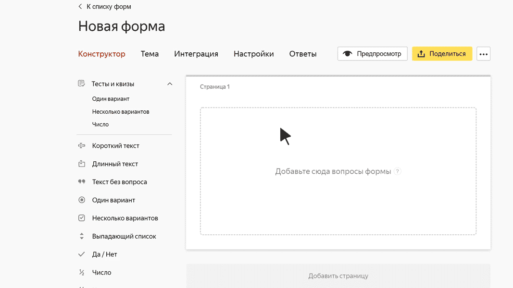

# Блок «Число»

В этом блоке пользователь может ввести целое или дробное число. Например, рост в метрах или температуру тела.

## Настройки блока {#sec_settings}

### Вопрос {#question}

Введите заголовок поля или формулировку вопроса.





### Валидация {#validate}

