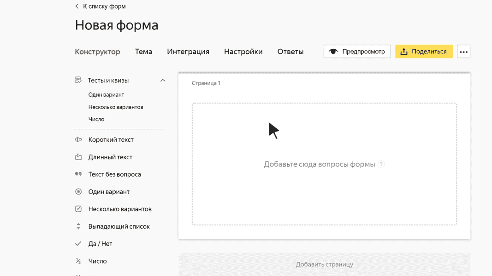

# Блок «Один вариант»

В этом блоке пользователь может выбрать один вариант ответа из нескольких заданных. Например, указать свое семейное положение.

## Настройки блока {#sec_settings}

### Вопрос {#param-question}

Введите формулировку вопроса.











