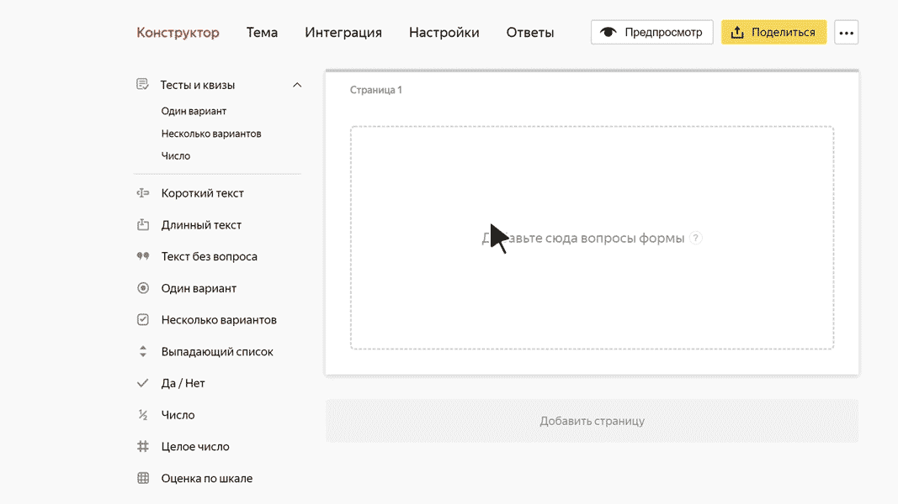

# Оценка по шкале

В этом блоке пользователь может оценить какой-либо предмет или событие по заданной шкале. Например, если вы хотите собрать отзывы о мероприятии, можно попросить пользователя оценить по пятибалльной шкале качество организации, темы докладов, работу ведущего.

## Настройки блока {#sec_settings}

### Вопрос {#param-question}

Введите формулировку вопроса, например просьбу поставить оценки.
    


- Для правильной работы вопроса задайте хотя бы один [критерий](#param-criterion).

### Критерии {#param-criterion}

В разделе **Критерии** задайте критерии для оценки предмета или перечислите несколько предметов, которые нужно оценить. Например, для оценки мероприятия можно задать критерии: качество организации, темы докладов, работа ведущего.

- Чтобы добавить критерий, выберите поле **Добавить вариант** и введите название.

- Чтобы изменить положение критерия в списке, перетащите его за значок . 

- Чтобы удалить критерий, нажмите значок .

### Ответы {#param-answers}

В разделе **Ответы** задайте шкалу оценки. Пользователю нужно будет выбрать один из заданных вариантов ответа для каждого критерия. Например, для оценки по пятибалльной шкале можно задать в качестве ответов числа от 1 до 5. Либо можно задать три уровня оценки: <q>хорошо</q>, <q>удовлетворительно</q>, <q>плохо</q>.

- Чтобы добавить вариант ответа, выберите поле **Добавить вариант** и введите текст ответа.

- Чтобы форматировать текст ответа, используйте [разметку Markdown](../appearance.md#section_pzm_m1j_j3b).

- Чтобы изменить положение варианта в списке, перетащите его за значок . 



