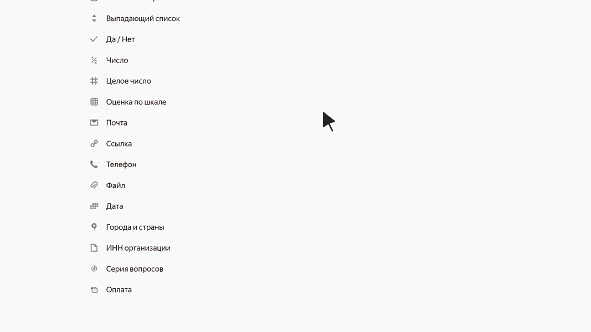

# Серия вопросов

Серия вопросов объединяет несколько вопросов других типов. При заполнении формы можно скопировать серию вопросов и повторно ответить на вопросы серии. Это удобно, если на одной форме нужно несколько раз ввести однотипные данные.

Например, в форму для регистрации участников мероприятия можно добавить серию вопросов, которая будет состоять из полей <q>Имя</q>, <q>Фамилия</q>, <q>Электронная почта</q>. Тогда пользователь сможет создать групповую заявку на участие в мероприятии — скопировать серию вопросов и ввести данные нескольких участников в одной форме.

Также с помощью серии можно объединить несколько вопросов в группу и настроить для них общие [условия показа](../add-questions.md#conditions).

Чтобы добавить серию вопросов:

1. Добавьте блок **Серия вопросов** на рабочую область формы.

1. Чтобы добавить вопросы в серию, перетащите их с рабочей области или с левой панели в блок **Серия вопросов**.  Вопросы, входящие в серию, выделены вертикальной полосой вдоль левого края рабочей области. Вопросы в серии можно [редактировать](../add-questions.md#params) так же, как одиночные вопросы.



Если в серию вопросов объединить вопросы из категории [**Тесты и квизы**](tests-ref.md), то [подсчет баллов](../tests.md#test-result) в тесте не сработает.



1. Чтобы изменить заголовок серии вопросов, нажмите на него.

1. Чтобы изменить положение серии вопросов на форме, наведите указатель на серию и перетащите ее за значок  на нужное место.

1. Чтобы [настроить условия показа](../add-questions.md#conditions) серии вопросов, наведите на нее указатель и нажмите появившийся значок .

