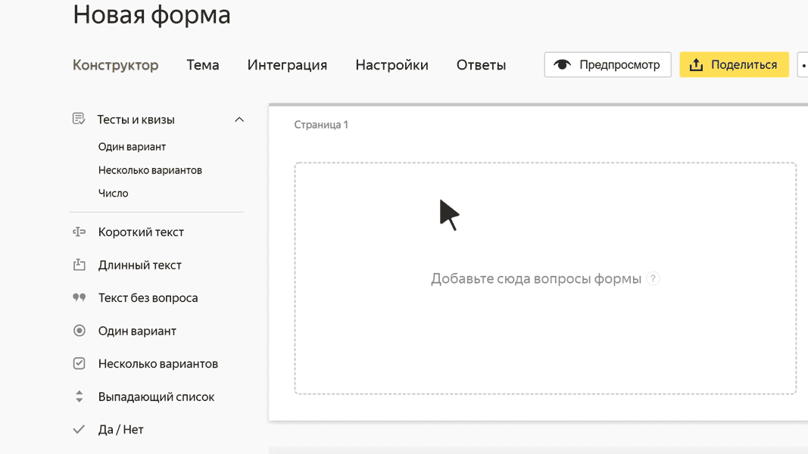

# Короткий текст

В этом блоке пользователь может ввести произвольное слово или короткую фразу. Например, имя или фамилию.

В поле <q>Короткий текст</q> можно ввести не более 255 символов.

## Настройки блока {#sec_settings}

### Вопрос {#param-question}

Введите заголовок поля или формулировку вопроса.







### Ограничить количество символов в ответе {#param-symbol-max}

Задайте минимальную и максимальную длину ответа.



При любом значении максимальной длины ответа в поле <q>Короткий текст</q> можно ввести не более 255 символов.



### Добавить подсказку {#param-tip}

Включите эту опцию, чтобы при вводе текста показывать пользователю варианты ответа из справочника. Выберите тип подсказки:

- **Департамент**, **Команда**, **Пользователь** — пользователи или подразделения из адресной книги организации в [{{ org-full-name }}]({{ link-org-main }}). 

- **Адрес**, **Города**, **Страны** — подсказка из справочника адресов.

- **Email адреса** — адрес электронной почты пользователя.

- **Пол** — пол пользователя.

### Валидация {#param-validation}

