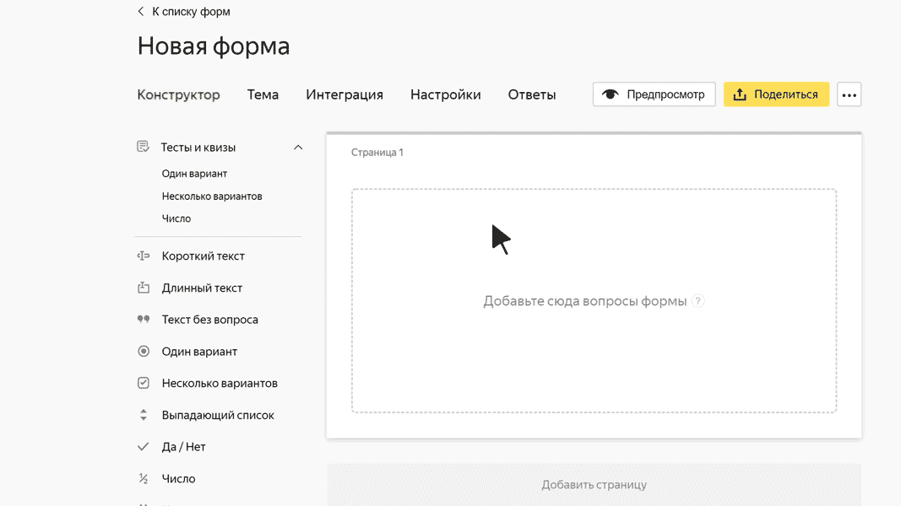

# Блок для теста «Несколько вариантов»

В этом блоке пользователь может выбрать несколько ответов из предложенных вариантов. Правильными могут быть один или несколько ответов. Пользователь получит баллы за этот вопрос, только если выберет все правильные варианты ответа и не выберет неправильных.

> **Например, вопрос:** Какие из перечисленных городов находятся в Италии?
> 
> **Варианты ответов:**
> 
> - Ницца — 0 баллов.
> - Неаполь — 1 балл.
> - Валенсия — 0 баллов.
> - Милан — 1 балл.
> 
> Среди предложенных вариантов ответа два правильных: Неаполь и Милан. Если пользователь выберет эти два города и не выберет Ниццу и Валенсию, он получит 2 балла.

## Настройки блока {#sec_settings}

### Вопрос {#question}

Напишите формулировку вопроса.





Под всеми вариантами ответа, которые вы считаете правильными, включите опцию **Правильный**.

Под правильными вариантами ответа укажите количество баллов, которое получит пользователь за каждый ответ. Это должно быть целое или дробное положительное число, у которого не больше 2 знаков после запятой.
    Баллы за все правильные варианты ответа суммируются. Пользователь получит сумму баллов, только если выберет все правильные варианты ответа на вопрос.





