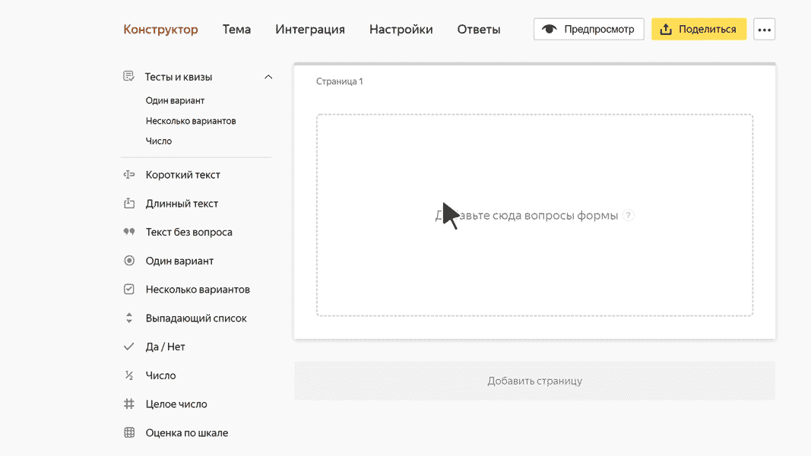

# Блок для теста «Число»

Этот блок предназначен для вопросов, в ответ на которые пользователю нужно ввести число. Например, решение уравнения.

Ответом на вопрос должно быть целое или дробное число, у которого не больше 2 знаков после запятой. Формат введенного числа проверяется, когда пользователь завершает тест.

## Настройки блока {#sec_settings}

### Вопрос {#question}

Введите формулировку вопроса, ответом на который является число.



### Ответы {#answer}

1. Введите правильный ответ на вопрос. Это должно быть целое или дробное число, у которого не больше 2 знаков после запятой.

1. Укажите количество баллов, которое получит пользователь за правильный ответ. Это должно быть целое или дробное положительное число, у которого не больше 2 знаков после запятой.

