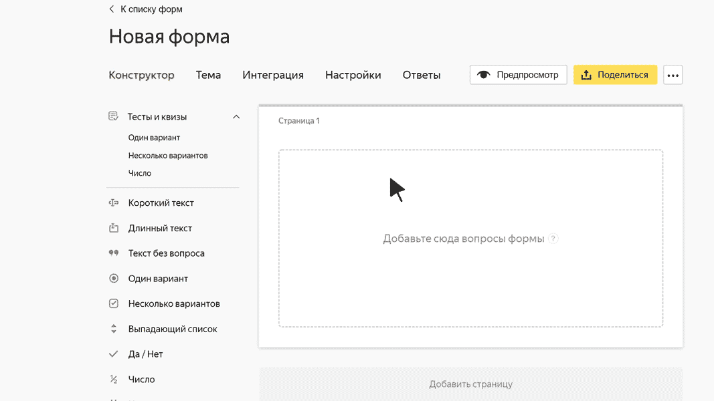

# Блок для теста «Один вариант»

В этом блоке пользователь может выбрать один ответ из предложенных вариантов. При этом правильными могут быть несколько вариантов ответа. Если пользователь выберет один из правильных вариантов, он получит баллы только за него.

> **Например, вопрос в тесте про путешествия:** Сколько раз вы выезжали за границу в прошлом году?
> 
> **Варианты ответов:**
> 
> - Не выезжал — 0 баллов.
> - Один раз — 1 балл.
> - Два-три раза — 3 балла.
> - Больше трех раз — 5 баллов.
> 
> Все предложенные варианты ответа правильные. Чем чаще пользователь бывает за границей, тем больше баллов он получит за этот вопрос.

## Настройки блока {#sec_settings}

### Вопрос {#question}

Напишите формулировку вопроса.



 

Под всеми вариантами ответа, которые вы считаете правильными, включите опцию **Правильный**.

Под правильными вариантами ответа укажите количество баллов, которое получит пользователь за каждый ответ. Это должно быть целое или дробное положительное число, у которого не больше 2 знаков после запятой.
    Пользователь получит баллы только за тот ответ, который выберет.







