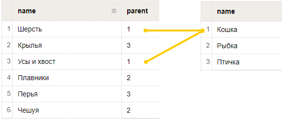

# Вики



Этот блок доступен только пользователям [{{ forms-full-name }} для бизнеса](../forms-for-org.md).



В этом блоке пользователь может ввести варианты ответов, которые подгружаются из [динамической таблицы {{ wiki-name }}](../../wiki/create-grid.md). При вводе текста работает подсказка по допустимым вариантам ответов. Ответы, которых нет в таблице, не принимаются.



 Данные из [динамической таблицы {{ wiki-name }}](../../wiki/create-grid.md) обновляются каждые 30 минут, поэтому варианты ответов могут загружаться с задержкой.



Если в форме используется несколько блоков {{ wiki-name }}, можно [настроить фильтрацию вариантов ответов](#filter). В этом случае набор допустимых ответов в одном блоке {{ wiki-name }} будет меняться в зависимости от ответа, выбранного в другом блоке.

## Настройки блока {#sec_settings}

### Вопрос

Введите заголовок поля или формулировку вопроса.





### Ссылка на таблицу ответов

В разделе **Настройки** вставьте в поле абсолютную или относительную ссылку на [динамическую таблицу с вариантами ответов](#sec_table). Например: 

`{{ link-wiki }}users/<имя-пользователя>/<имя-таблицы>`

`/users/<имя-пользователя>/<имя-таблицы>`

### Добавить фильтрацию ответов {#filter}

С помощью этой опции можно фильтровать варианты ответов в блоке {{ wiki-name }} — загружать из динамической таблицы разные строки в зависимости от ответа, выбранного в другом блоке {{ wiki-name }}. Для этого добавьте на форму по крайней мере два блока {{ wiki-name }}:
* Родительский блок.

* Блок с фильтрацией, варианты ответов в котором будут зависеть от ответа, который пользователь выбрал в родительском блоке.

Чтобы фильтровать варианты ответов:
1. Добавьте на форму родительский блок {{ wiki-name }} или выберите в качестве родительского существующий блок.

1. Создайте [таблицу ответов с дополнительным столбцом для фильтрации](#sec_filter).

1. Добавьте на форму блок с фильтрацией и в разделе **Настройки** укажите ссылку на созданную таблицу.

1. Включите опцию **Добавить фильтрацию ответов**.

1. В списке **Выберите вопрос для фильтрации** укажите блок {{ wiki-name }} с родительской таблицей. 

## Создать таблицу ответов {#sec_table}

Таблица ответов для блока {{ wiki-name }} должна иметь специальный формат. Чтобы создать такую таблицу:

1. В [{{ wiki-full-name }}]({{ link-wiki }}) создайте [динамическую таблицу](../../wiki/create-grid.md).

1. Добавьте в таблицу столбец с именем `name`.
   Если в таблице будут другие столбцы, они не повлияют на варианты ответов в блоке {{ wiki-name }}.

1. Добавьте в таблицу несколько строк и введите в ячейки столбца `name` варианты ответов, которые должны быть доступны в блоке {{ wiki-name }}.

1. Убедитесь, что у служебного аккаунта `yndx-wiki-cnt-robot@` есть [доступ к таблице](../../wiki/page-management/access-setup.md). Этот аккаунт также имеет доступ к таблице, если установлен режим **Доступно всем сотрудникам**. 

1. Укажите ссылку на таблицу в настройках блока {{ wiki-name }}.

## Создать таблицу с фильтрацией ответов {#sec_filter}

Чтобы создать таблицу с фильтрацией ответов:

1. В [{{ wiki-full-name }}]({{ link-wiki }}) создайте [динамическую таблицу](../../wiki/create-grid.md).

1. Добавьте в таблицу два столбца с именами `name` и `parent`.
   Если в таблице будут другие столбцы, они не повлияют на варианты ответов в блоке {{ wiki-name }} и их фильтрацию.

1. Добавьте в таблицу несколько строк и введите в ячейки столбца `name` варианты ответов, которые должны быть доступны в блоке {{ wiki-name }}.

1. Свяжите каждый вариант ответа со строкой в родительской таблице — таблице, которая указана в настройках родительского блока {{ wiki-name }}. Для этого в столбце `parent` укажите номер строки в родительской таблице, при выборе которой ответ будет подгружаться в блок {{ wiki-name }} с фильтрацией.
   Например, если в родительском блоке пользователь выберет ответ из строки с номером `1`, то в блоке с фильтрацией будут доступны варианты ответа, у которых в столбце `parent` указан номер `1`.

   

1. Убедитесь, что у служебного аккаунта `yndx-wiki-cnt-robot@` есть [доступ к таблице](../../wiki/page-management/access-setup.md). Этот аккаунт также имеет доступ к таблице, если установлен режим **Доступно всем сотрудникам**. 

1. Укажите ссылку на таблицу в настройках блока {{ wiki-name }} и [включите фильтрацию ответов](#dlentry_filter).