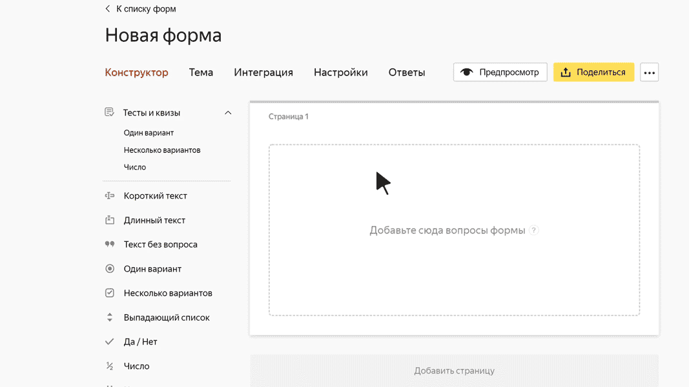

# Да / нет

В этом блоке пользователь может установить флажок (поставить <q>галочку</q>), чтобы выразить свое согласие с каким-либо утверждением или действием. Например, подтвердить, что пользователю больше 18 лет, или согласиться на получение почтовой рассылки.

## Настройки блока {#sec_settings}

### Вопрос {#question}

Введите формулировку вопроса или утверждение, с которым пользователь может согласиться или не согласиться. Например: <q>Я согласен получать новости по почте</q>.









