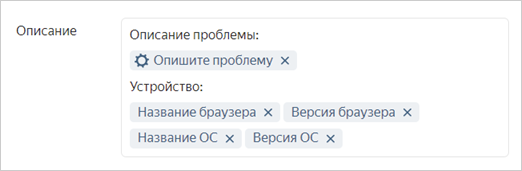
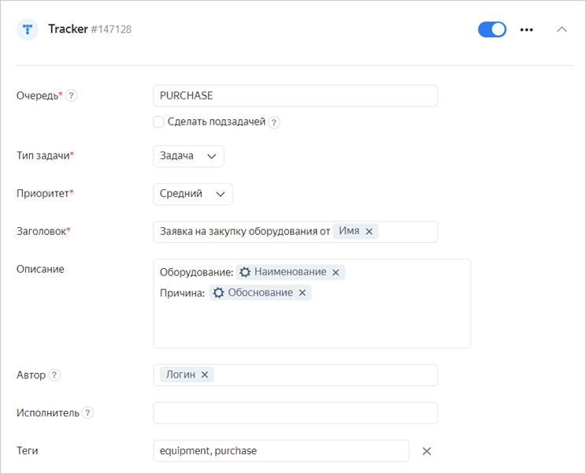

# Создать задачу в {{ tracker-full-name }}



Интеграцию с {{ tracker-short-name }} могут настроить пользователи [{{ forms-full-name }} для бизнеса](forms-for-org.md).



В форме можно настроить интеграцию с [{{ tracker-short-name }}]({{ link-tracker }}), чтобы автоматически создавать задачи при заполнении формы. Ответы пользователя передаются из формы в {{ tracker-short-name }}, и на их основе создается задача. Например, такие формы удобно использовать для приема заявок на обслуживание или сбора сообщений об ошибках. Подробнее о задачах читайте в [Справке {{ tracker-full-name }}](../tracker/user/create-ticket.md).

## Настроить создание задач в {{ tracker-short-name }} {#setup}

1. Выберите форму и перейдите на вкладку **Интеграция**.

1. Выберите [группу действий](notifications.md#add-integration), в которой вы хотите настроить создание задачи, и внизу группы нажмите кнопку  **{{ tracker-short-name }}**.

1. Введите ключ [очереди](../tracker/queue-intro.md), в которой будет создана задача.

1. Чтобы создать [подзадачу](../tracker/user/create-ticket.md#subtask), включите опцию **Сделать подзадачей** и введите ключ родительской задачи.

  
1. Задайте тип, приоритет задачи и настройте другие параметры.
    
    **Формат ввода данных**. В полях **Автор**, **Исполнитель**, **Теги**, **Компоненты** и подобных при вводе значений не работает подсказка.

    - В полях **Автор**, **Исполнитель**, **Наблюдатели** указывайте логин пользователя.
      Чтобы в поле **Наблюдатели** указать несколько пользователей, введите их логины через запятую (например, `ivanov,petrov`). 
    
    - Если функция заполнения поля **Автор** не настроена, и форму заполнил человек, состоящий в организации, то в поле **Автор** будет отображено его имя.

    - Если же форму заполняет неавторизованный пользователь, то в поле **Автор** записывается <q>Робот сервиса {{ tracker-name }} Робот</q> (`yndx-tracker-cnt-robot@`).

    - Значения остальных полей вводите в точности, как они указаны в {{ tracker-short-name }}.

    - Чтобы добавить в поля **Компоненты** или **Теги** несколько значений, введите их через запятую.
    
    **Добавить поле задачи**. Если нужных параметров задачи нет в списке, добавьте их. Нажмите кнопку **Добавить параметр задачи** и начните вводить название, затем в подсказке выберите подходящий параметр. Подробнее о параметрах задач читайте в [Справке {{ tracker-full-name }}](../tracker/user/create-param.md).
    

    **Добавить в поле данные из формы**. В поля задачи можно вставить ответ на вопрос или другие данные из формы:
    
    - Выберите поле и справа нажмите кнопку **Переменные**.

    - Выберите в списке [переменную](vars.md), которую нужно добавить в поле.

    

    Чтобы добавить в поля **Автор**, **Исполнитель**, **Наблюдатели** сотрудника, указанного в ответе на вопрос типа <q>Люди</q>, добавьте в поле переменную **Идентификатор варианта ответа на вопрос**. Если вы используете переменную **Ответ на вопрос**, интеграция не сработает.

    

    Например, если с помощью формы вы собираете сообщения об ошибках, вы можете добавить в описание задачи сообщение пользователя и техническую информацию.
        
    

1. Чтобы после заполнения формы пользователь получил ссылку на созданную задачу, под заголовком действия включите опцию **Показывать сообщение о результате действия**.

1. Нажмите кнопку **{{ ui-key.yacloud.common.save }}**.

Чтобы создать несколько задач одновременно, добавьте новые действия с помощью кнопки  **{{ tracker-short-name }}** внизу страницы.

Если нужно создавать задачу, только когда пользователь ответил на вопросы определенным образом, [задайте условия](notifications.md#section_xlw_rjc_tbb).

> Пример интеграции с {{ tracker-short-name }} для формы с заявкой на закупку оборудования. С помощью такой формы сотрудники смогут оформлять заявки на оборудование в виде задач для отдела закупок.
>
> 

## Решение проблем {#troubles}

Если после заполнения формы создание задач в {{ tracker-short-name }} не работает или работает неправильно, проверьте ошибки интеграции:

1. Откройте форму, в которой не работает создание задач, и вверху страницы нажмите **Интеграция**.

1. Проверьте, появилось ли в настройках интеграции с {{ tracker-short-name }} сообщение об ошибке. 

1. Проверьте, есть ли решение вашей проблемы ниже на этой странице. После устранения проблемы попытайтесь [повторно запустить создание задачи](notifications.md#status).

1. Если проблему не удалось решить, [обратитесь в службу поддержки](feedback.md).

### Ошибка в полях Автор, Исполнитель, Наблюдатели

Возможная причина ошибки в том, что из формы в поля задачи **Автор**, **Исполнитель** или **Наблюдатели** передаются неверные данные. Заполните эти поля следующим образом:

- Чтобы добавить сотрудника вручную, указывайте логин пользователя, например `ivanov`.

- Чтобы в поле **Наблюдатели** указать несколько пользователей, введите их логины через запятую (например, `ivanov,petrov`). 

- Чтобы добавить сотрудника, указанного в ответе на вопрос типа <q>Люди</q>, вставьте в поле [переменную](vars.md) **Идентификатор варианта ответа на вопрос**. Если вы используете переменную **Ответ на вопрос**, интеграция не сработает.

- Чтобы добавить сотрудника, указанного в ответе на вопрос типа <q>Выпадающий список</q> или <q>Несколько вариантов</q>, в качестве вариантов ответов задайте логины пользователей (например, `ivanov`) и используйте [переменную](vars.md) **Ответ на вопрос**.

Если в поле **Автор** возникает ошибка, но поле при этом заполнено верно, убедитесь, что у заполнившего форму пользователя есть [доступ на создание задач в указанной очереди {{ tracker-short-name }}](#access).

### Ошибка: нет прав на запись в очередь {#access}

Причина ошибки в том, что у пользователя, который заполнил форму, нет прав на создание задач в указанной очереди {{ tracker-short-name }}. Попросите владельца очереди [проверить права доступа](../tracker/manager/queue-access.md).

