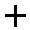

# Опубликовать форму в Дзене

Чтобы добавить форму в Дзен, используйте [виджет Формы]({{ support-zen-widget }}). Виджет позволяет создать форму с помощью легкой версии конструктора и опубликовать ее в статье. Вы также можете вставить в черновик статьи [ссылку](publish.md) на готовую форму.

## Создать форму в виджете {#lite}

В Дзене доступна легкая версия конструктора форм. Легкая версия поддерживает только основные типы вопросов формы. О том, какие еще элементы можно добавить в форму, читайте в разделе [{#T}](blocks-ref/blocks-reference.md).



Изменить [внешний вид формы](appearance.md), встроить [тесты и квизы](tests.md), добавить [дополнительные вопросы](add-questions.md) и настроить [логику](send-condition.md) их показа можно [в полной версии конструктора](#full).



1. В редакторе статьи Дзена в поле **Текст** нажмите  и выберите виджет **Формы**. Подробнее – в [Справке Дзена]({{ support-zen-widget-add }}).

1. Чтобы добавить первый вопрос, в области создания формы выберите тип вопроса. 

1. Чтобы добавить на страницу еще один вопрос, наведите указатель на созданный вопрос и нажмите значок . Новый вопрос появится выше текущего, если навести указатель на верхнюю часть блока.

1. Чтобы скопировать или удалить вопрос, нажмите  или .

1. Чтобы добавить иллюстрацию к тексту вопроса или варианту ответа, нажмите значок .

1. Чтобы разбить форму на несколько страниц, под областью создания формы нажмите кнопку **Добавить страницу**.

1. Чтобы отображать статистику ответов после того, как пользователь заполнит форму, включите опцию **Показывать статистику ответов после отправки формы**. Статистика отображается для вопросов типа **Список**.

1. Когда все будет готово, нажмите кнопку **Опубликовать**.

## Провести тест {#test}

С помощью виджета **Формы** вы можете провести тест, квиз или викторину в своей статье. Дополнительные настройки [тестов и квизов](tests.md) доступны [в полной версии конструктора](#full).

1. В редакторе статьи Дзена в поле **Текст** нажмите  и выберите виджет **Формы**. Подробнее – в [Справке Дзена]({{ support-zen-widget-add }}).

1. Добавьте вопрос:

    - **Список** — для выбора одного или нескольких вариантов ответа;

    - **Число** — чтобы указать целое или дробное число.

1. Если вы выбрали **Список**, укажите его тип: **Один вариант** или **Несколько вариантов**.

1. Введите формулировку вопроса.

1. Чтобы настроить правильные и неправильные ответы, включите опцию  **Баллы**.

1. Введите варианты ответа и количество баллов за каждый из них. Для неправильных вариантов укажите 0 баллов.

1. Чтобы добавить на страницу еще один вопрос, наведите указатель на созданный вопрос и нажмите значок . Новый вопрос появится выше текущего, если навести указатель на верхнюю часть блока.

1. Внизу страницы нажмите кнопку **Подсчет результатов тестирования** и на панели справа настройте правила [подсчета результата](tests.md#test-result):
 
    1. Выберите способ подсчета: **Диапазон**, чтобы распределить результаты по сегментам, или **Зачёт/Незачёт**.
 
    1. Чтобы показать пользователю количество набранных баллов, включите опцию **Показывать результат прохождения теста**.

    1. Чтобы показать пользователю, на какие вопросы даны верные или неверные ответы, включите опцию **Показывать правильные и неправильные ответы**.

    1. Нажмите кнопку **Сохранить**.

1. Чтобы после завершения теста пользователь мог сравнить свои ответы с ответами других участников, под списком ответов включите опцию **Показывать статистику ответов после отправки формы**. Статистика отображается для вопросов типа **Список**.

1. Когда все будет готово, нажмите кнопку **Опубликовать**.

## Расширенная настройка формы {#full}

1. Внизу страницы нажмите кнопку **К полной версии**. Откроется окно со ссылкой для перехода в полную версию.

1. Перейдите по ссылке.

1. Отредактируйте форму.

1. Вернитесь на страницу с легкой версией конструктора и нажмите **Опубликовать**. Виджет с формой будет добавлен в черновик статьи.

## Редактирование и просмотр ответов {#edit}

После публикации форму всегда можно [отредактировать](forms-settings.md#section_kwd_p5b_tbb) в полной версии конструктора. Сохраните изменения в конструкторе и обновите страницу с опубликованной формой — изменения отразятся в статье автоматически.

[Ответы](answers.md) на форму можно посмотреть в полной версии конструктора.