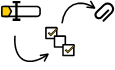
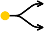
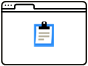
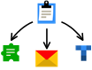

# Что такое {{ forms-full-name }}

[{{ forms-full-name }}](go-to-forms.md) помогут вам создавать опросы, собирать отзывы, принимать заявки, проводить тесты и квизы.

Составьте форму из вопросов, на которые будут отвечать пользователи, и опубликуйте ее. Когда пользователи заполнят форму, вы сможете получить ответы и использовать данные для интеграции с другими сервисами.

**Простая структура**
 | [Создавайте формы](new-form.md) из простых блоков, которые
 можно комбинировать в любом порядке.  [Проводите тесты и квизы.](tests.md)
**Гибкость**
 | [Настраивайте условия](add-questions.md#section_q2t_zqz_sbb), чтобы показывать или скрывать вопросы в зависимости от предыдущих ответов пользователя.  [Настройте внешний вид формы.](appearance.md)
**Публикация**
 | [Публикуйте формы](publish.md) по прямым ссылкам, размещайте их на сайте или встраивайте их в вики-страницы. Любую форму можно сделать публичной или доступной только вашим сотрудникам.  [Публикуйте формы](publish.md) по прямым ссылкам или размещайте на сайте. Любую форму можно сделать публичной или доступной только вашим сотрудникам.  Настройте автоматическое [предзаполнение полей формы](pre-fill.md).  [Переведите форму на иностранные языки.](localize.md)
**Интеграция с другими сервисами**
 | [Настройте интеграцию](notifications.md) чтобы отправлять данные из формы на Почту, {{ wiki-name }} или {{ tracker-name }}.  [Настройте интеграцию](notifications.md) чтобы отправлять данные из формы на Почту, в {{ tracker-name }} и другие сервисы Яндекса.

