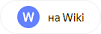
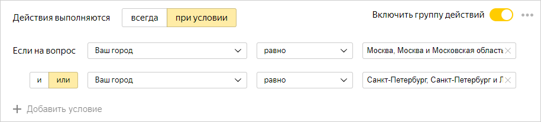
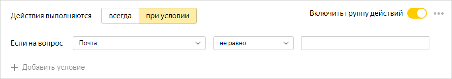

# Интеграция с другими сервисами

Настройте интеграцию формы с другими сервисами, чтобы использовать их возможности для обработки ответов пользователей и других данных из формы. Вы можете:

- [Опубликовать форму в Яндекс&#160;Дзене.](forms-lite.md)

- [Настроить действия](#add-integration), которые будут выполняться автоматически при заполнении формы:

    - [Отправлять уведомление по почте.](send-mail.md)

    - [Создавать задачу в {{ tracker-name }}](create-task.md) и добавлять в нее данные из формы.

    - [Добавлять ответ пользователя на {{ wiki-name }}.](send-wiki.md)

    - [Отправлять HTTP-запрос.](send-request.md)

- [Подключить счетчик Яндекс&#160;Метрики](metrica.md) и собирать статистику посещения формы.

Для каждой формы можно настроить сразу несколько автоматических действий и [задать условия их выполнения](#section_xlw_rjc_tbb) в зависимости от ответов пользователя на вопросы формы.



Интеграции с сервисами {{ wiki-name }} и {{ tracker-name }} доступны только пользователям [{{ forms-full-name }} для бизнеса](forms-for-org.md).



## Добавить действия {#add-integration}

Для интеграции формы с другими сервисами можно настроить одно или несколько действий, которые будут выполняться автоматически при отправке заполненной формы. Для этого:

1. Выберите форму и перейдите на вкладку **Интеграция**.

1. Добавьте группу действий или используйте существующую. В группу можно добавить несколько действий и задать для них общие условия выполнения.

    

    По умолчанию во всех формах настроена группа с одним действием — отправкой письма по почте. Эта группа отключена, вы можете удалить ее либо включить и добавить свои действия.
    
    

    - Чтобы добавить группу действий, внизу страницы нажмите кнопку **Добавить группу уведомлений**.

    - Чтобы создать новую группу действий на основе существующей, в правом верхнем углу рядом с переключателем **Включить группу действий** нажмите значок  и выберите **Копировать группу действий**. Затем отредактируйте копию.

    - Чтобы включить или выключить группу действий, используйте переключатель  в правом верхнем углу.

    - Чтобы удалить группу действий, в правом верхнем углу нажмите значок  и выберите **Удалить группу действий**.

1. Если требуется, [настройте для группы условия выполнения действий](#section_xlw_rjc_tbb). 
Чтобы настроить несколько действий, которые будут выполняться при различных условиях, добавьте несколько групп.

1. Чтобы добавить в группу действие, внизу группы нажмите одну из кнопок и настройте параметры действия:

    - Для [отправки уведомления по почте](send-mail.md) нажмите кнопку .

    - Для [создания задачи в {{ tracker-name }}](create-task.md) нажмите кнопку . 

    - Для [добавления ответа на вики-страницу](send-wiki.md) нажмите кнопку .

    - Для [отправки HTTP-запроса](send-request.md) нажмите кнопку с нужным типом запроса.

    
    

    Интеграции с сервисами {{ wiki-name }} и {{ tracker-name }} доступны только пользователям [{{ forms-full-name }} для бизнеса](forms-for-org.md).

    

1. Чтобы отключить действие, используйте переключатель  в правом верхнем углу.

1. Чтобы удалить действие, нажмите значок .

1. Чтобы применить изменения, внизу страницы нажмите кнопку **Сохранить**.

## Настроить условия {#section_xlw_rjc_tbb}

Вы можете настроить условия для интеграции формы с другими сервисами. Тогда заданные действия (отправка уведомлений или создание задач) будут выполняться, только если пользователь дал определенные ответы на вопросы формы. Чтобы задать условия выполнения действий:

1. Выберите форму и перейдите на вкладку **Интеграция**.

1. Выберите группу действий и включите опцию **Действия выполняются при условии**.

1. Задайте условия для выполнения действий:

    1. Укажите вопрос, ответ на который будет условием действия.

    1. Выберите операцию сравнения: **равно** или **не равно**. 

    1. Выберите или введите ответ, совпадение с которым требуется проверять.
        

        - Если действия должны срабатывать, когда пользователь дал любой ответ на вопрос (поле на форме заполнено), в условии выберите операцию сравнения **не равно** и оставьте поле для ответа пустым.

        - Если действия должны срабатывать, когда пользователь не ответил на вопрос (поле на форме не заполнено), в условии выберите операцию сравнения **равно** и оставьте поле для ответа пустым.

       Например, можно настроить отправку письма пользователю в том случае, если на форме заполнено поле **Почта**.
       

1. Чтобы добавить несколько условий, нажмите ссылку **Добавить условие** и задайте логический оператор.

    - Если между двумя условиями задан логический оператор **И**, требуется одновременное выполнение условий. Если задан оператор **ИЛИ**, требуется выполнение хотя бы одного условия.

    - Если вы добавите несколько условий с различными операторами, проверка условий будет выполняться по порядку сверху вниз. Оператор **И** не имеет приоритета над оператором **ИЛИ**.

   

   Чтобы получить предсказуемый результат проверки группы условий, рекомендуем использовать однотипные операторы: все условия с оператором **И** или все условия с оператором **ИЛИ**. 

   

1. Чтобы применить изменения, внизу страницы нажмите кнопку **Сохранить**.

Чтобы добавить несколько действий с различными условиями, нажмите кнопку **Добавить группу уведомлений** внизу страницы и [задайте действия](#add-integration).

## Ошибки интеграции {#status}

Если при получении ответов на форму интеграция не сработала и не удалось выполнить [заданные действия](#add-integration), в заголовке вкладки **Интеграция** появится значок . На карточке действия отобразится список ответов, для которых произошли ошибки интеграции.

В случае ошибки выберите один из вариантов действий:

- Проверьте настройки действия и при необходимости внесите изменения. Чтобы попытаться повторно выполнить действие, под описанием ошибки нажмите кнопку **Перезапустить все**.
- Чтобы сохранить данные, которые не удалось отправить при выполнении действия, нажмите кнопку **Скачать ответы** и выберите формат файла.
- Чтобы очистить информацию об ответах с ошибками интеграции и не выполнять для них заданные действия, нажмите кнопку **Скрыть ошибки**.

Читайте подробнее:

- [Решение проблем при интеграции с почтой.](send-mail.md#troubleshooting)

- [Решение проблем при интеграции с {{ tracker-name }}.](create-task.md#troubles)

