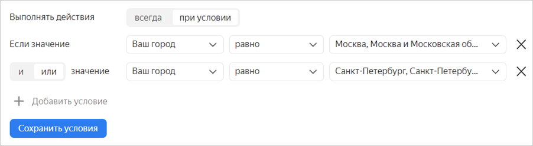
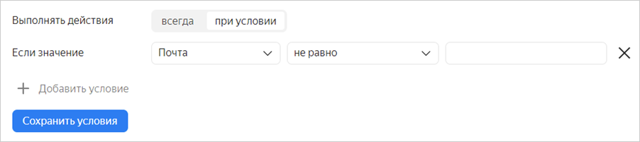

# Интеграция с другими сервисами

Настройте интеграцию формы с другими сервисами, чтобы использовать их возможности для обработки ответов пользователей и других данных из формы. Вы можете:

- [Настроить действия](#add-integration), которые будут выполняться автоматически при заполнении формы:

    - [Отправлять уведомление по почте](send-mail.md).

    - [Создавать задачу в {{ tracker-name }}](create-task.md) и добавлять в нее данные из формы.

    - [Добавлять ответ пользователя на {{ wiki-name }}](send-wiki.md).

    - [Отправлять HTTP-запрос к API](send-request.md).
    

    - [Вызывать функцию {{ sf-name }}](call-function.md).

- [Подключить счетчик Яндекс&#160;Метрики](metrica.md) и собирать статистику посещения формы.

Для каждой формы можно настроить сразу несколько автоматических действий и [задать условия их выполнения](#section_xlw_rjc_tbb) в зависимости от ответов пользователя на вопросы формы.



Интеграции с сервисами {{ wiki-name }} и {{ tracker-name }} доступны только пользователям [{{ forms-full-name }} для бизнеса](forms-for-org.md).



## Добавить действия {#add-integration}

Для интеграции формы с другими сервисами можно настроить одно или несколько действий, которые будут выполняться автоматически при отправке заполненной формы. Для этого:

1. Выберите форму и перейдите на вкладку **Интеграция**.

1. Добавьте группу действий или используйте существующую. В группу можно добавить несколько действий и задать для них общие условия выполнения.

    

    По умолчанию во всех формах настроена группа с одним действием — отправкой письма по почте. Эта группа включена, вы можете выключить или удалить группу или добавить в нее свои действия.
    
    

    - Чтобы создать новую группу, внизу страницы нажмите кнопку **Добавить группу уведомлений**.

    - Чтобы создать группу действий на основе существующей, в правом верхнем углу нажмите значок  и выберите **Копировать группу действий**. Затем отредактируйте копию.

    - Чтобы включить или выключить группу действий, используйте переключатель  в правом верхнем углу.

    - Чтобы удалить группу действий, в правом верхнем углу нажмите значок  и выберите **Удалить группу действий**.

1. Если требуется, [настройте для группы условия выполнения действий](#section_xlw_rjc_tbb). 
Чтобы настроить несколько действий, которые будут выполняться при различных условиях, добавьте несколько групп.

1. Чтобы добавить в группу действие, внизу группы нажмите одну из кнопок:

    - Для [отправки уведомления по почте](send-mail.md) нажмите кнопку  **{{ ui-key.forms.common.blocks_integration-group.title-email }}**.

    - Для [создания задачи в {{ tracker-name }}](create-task.md) нажмите кнопку  **{{ tracker-short-name }}**. 

    - Для [добавления ответа на вики-страницу](send-wiki.md) нажмите кнопку  **{{ wiki-name }}**.

    - Для [отправки HTTP-запроса](send-request.md) нажмите кнопку  **API** и выберите тип запроса.

    

    Интеграции с сервисами {{ wiki-name }} и {{ tracker-name }} доступны только пользователям [{{ forms-full-name }} для бизнеса](forms-for-org.md).

    

1. Настройте действие и нажмите кнопку **{{ ui-key.yacloud.common.save }}**.

1. Чтобы отключить действие, используйте переключатель  в правом верхнем углу.

1. Чтобы удалить действие, нажмите значок  и выберите **{{ ui-key.yacloud.common.delete }}**.

## Настроить условия {#section_xlw_rjc_tbb}

Вы можете настроить условия для интеграции формы с другими сервисами. Тогда заданные действия (отправка уведомлений или создание задач) будут выполняться, только если пользователь дал определенные ответы на вопросы формы. Чтобы задать условия выполнения действий:

1. Выберите форму и вверху страницы нажмите **Интеграция**.

1. Выберите группу действий и включите опцию **Выполнять действия при условии**.

1. Чтобы действие выполнялось в зависимости от ответов на вопросы формы:

    1. Укажите вопрос, ответ на который будет условием действия.

    1. Выберите операцию сравнения: **равно** или **не равно**. 

    1. Выберите или введите ответ, совпадение с которым требуется проверять.
        

        - Если действия должны срабатывать, когда пользователь дал любой ответ на вопрос (поле на форме заполнено), в условии выберите операцию сравнения **не равно** и оставьте поле для ответа пустым.

        - Если действия должны срабатывать, когда пользователь не ответил на вопрос (поле на форме не заполнено), в условии выберите операцию сравнения **равно** и оставьте поле для ответа пустым.

       Например, можно настроить отправку письма пользователю в том случае, если на форме заполнено поле **{{ ui-key.forms.common.blocks_integration-group.title-email }}**.
       

1. Чтобы добавить несколько условий, нажмите ссылку **Добавить условие** и задайте логический оператор.

    - Если между двумя условиями задан логический оператор **И**, требуется одновременное выполнение условий. Если задан оператор **ИЛИ**, требуется выполнение хотя бы одного условия.

    - Если вы добавите несколько условий с различными операторами, проверка условий будет выполняться по порядку сверху вниз. Оператор **И** не имеет приоритета над оператором **ИЛИ**.

   

   Чтобы получить предсказуемый результат проверки группы условий, рекомендуем использовать однотипные операторы: все условия с оператором **И** или все условия с оператором **ИЛИ**. 

   

1. Нажмите кнопку **Сохранить условия**.   

Чтобы добавить несколько действий с различными условиями, нажмите кнопку **Добавить группу действий** внизу страницы и задайте для новой группы условия и [действия](#add-integration).

## Выполненные интеграции {#completed-integration}

Чтобы просмотреть выполненные интеграции, выберите форму и перейдите на вкладку **Интеграция** → **Выполненные интеграции**. 

Чтобы отфильтровать список интеграций, используйте поля, которые расположены над списком. 



Данные о выполненных интеграциях хранятся 90 дней, по истечении которых удаляются без возможности восстановления. 



### Ошибки интеграции {#status}

Если при получении ответов на форму интеграция не сработала и не удалось выполнить [заданные действия](#add-integration), на карточке с настройками действия появится сообщение о возникшей ошибке.

1. Проверьте настройки действия и при необходимости внесите изменения.

1. Чтобы увидеть список ответов, для которых действие завершилось с ошибкой, нажмите кнопку **Показать**.

1. Чтобы попытаться повторно выполнить действия, выберите строки со статусом **Ошибка** и нажмите кнопку **Перезапустить**.

Читайте подробнее:

- [Решение проблем при интеграции с почтой.](send-mail.md#troubleshooting)

- [Решение проблем при интеграции с {{ tracker-name }}.](create-task.md#troubles)

### Настроить уведомления об ошибках интеграций {#error-notification}

Чтобы уведомления о проблемах с интеграцией приходили на почту: 

1. Выберите форму и перейдите на вкладку **Настройки** → **Дополнительно**. 

1. В поле **Уведомлять об ошибках интеграций** выберите периодичность, с которой будет отправляться уведомление.  

    При выборе интервала будет отправлено одно уведомление со списком всех ошибок за указанный интервал.

1. Если вы пользуетесь [{{ forms-full-name }} для бизнеса](forms-for-org.md), в поле **Добавить получателей** укажите пользователей, которым будут отправляться сообщения. 

Чтобы отключить уведомления, выберите **Не уведомлять**.

