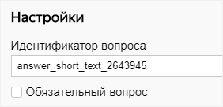
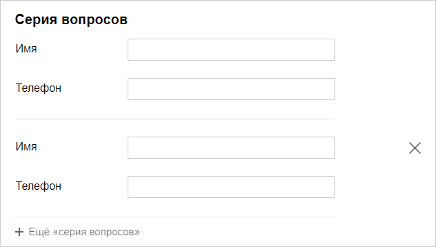
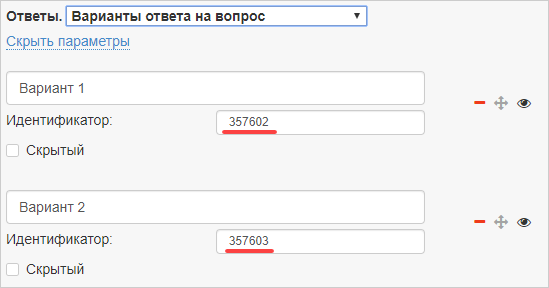
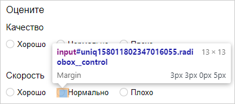
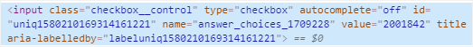
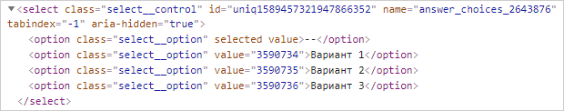
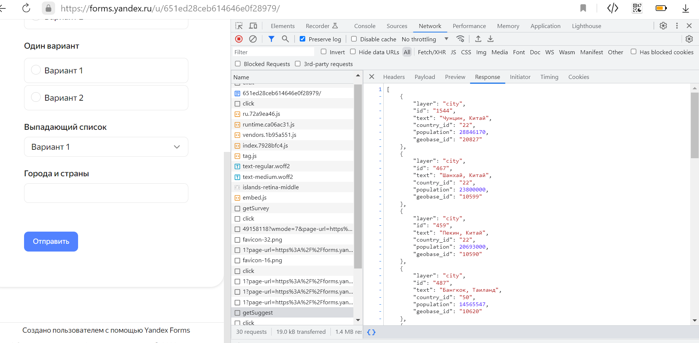
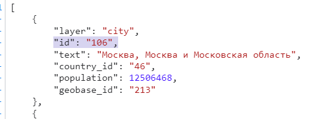

# Получить идентификаторы вопросов и ответов

Идентификаторы вопросов и ответов используются для предзаполнения форм. Существует несколько способов получить идентификаторы для разных типов вопросов.

## Идентификатор вопроса {#sec_question}

Идентификатор вопроса можно узнать в [окне редактирования вопроса](add-questions.md#section_jpy_2xg_qbb) в разделе **Настройки**.

## Идентификаторы для серии вопросов {#series}

[Серию вопросов](blocks-ref/series.md) пользователь может добавить на форму несколько раз. Таким образом, вопросы из серии могут повторяться. Чтобы различать несколько экземпляров одного и того же вопроса, к идентификаторам вопросов в серии добавляется суффикс — номер экземпляра через двойное подчеркивание. Нумерация начинается с нуля: `__0`, `__1`, `__2` и так далее.

Например, на форме есть серия вопросов:

* <q>Имя</q> с идентификатором `text_2643945`.

* <q>Телефон</q> с идентификатором `phone_2752014`.

Чтобы сделать предзаполнение полей в серии вопросов, настройте [GET-параметры](get-params.md):

* Для первого экземпляра серии (который отображается на форме по умолчанию) используйте идентификаторы вопросов: `text_2643945__0`, `phone_2752014__0`.

* Для второго экземпляра серии (который может добавить пользователь, нажав **Ещё «серия вопросов»**) используйте идентификаторы вопросов: `text_2643945__1`, `phone_2752014__1`.

## Идентификатор ответа {#sec_answer}

Чтобы узнать идентификатор ответа:

1. Выберите блок вопроса.

1. На панели слева в разделе **{{ ui-key.forms.common.blocks_correct-answers.title }}** нажмите значок **Расширенные параметры**.

1. Скопируйте значение из поля **Идентификатор**. 



Идентификаторы можно редактировать. Варианты ответов в пределах одного вопроса должны иметь уникальные идентификаторы.



## Идентификаторы ответов для вопросов <q>Оценки по шкале</q>, <q>{{ ui-key.forms.common.blocks_integration-group.title-wiki }}</q>, <q>Города и страны</q> {#sec_rating}

Идентификаторы ответов можно узнать в браузере с помощью инструментов разработчика. Этой функцией может воспользоваться как автор формы, так и пользователь, который ее заполняет.

[Посмотреть видео с примером.](https://frontend.vh.yandex.ru/player/4f65d1fbb351d66f900ec5d6d0aecdac?from=partner&mute=1&autoplay=1&tv=0&no_ad=false&loop=true&play_on_visible=false)

Рассмотрим получение идентификаторов на примере Яндекс&#160;Браузера:

1. [Откройте форму по ссылке](publish.md#section_link).

1. Откройте инструменты разработчика с помощью сочетания клавиш **Ctrl+Shift+I** (для Windows и Linux) или **⌘ + Option + I** (для macOS).

1. Выберите инструмент  и нажмите на поле, список или маркер нужного варианта ответа.

1. На вкладке **Elements** будет подсвечен фрагмент кода страницы с параметрами выбранного вопроса или варианта ответа.

1. Найдите в коде значения идентификаторов: 
    * Идентификатор вопроса — значение параметра `name` (кроме вопросов типа <q>Оценка по шкале</q>).

    * Идентификатор ответа — значение параметра `value`.
    

    
    * Для вопроса типа <q>Выпадающий список</q> в коде перечислены все доступные варианты ответов.
    

    * Для вопроса типа <q>Оценка по шкале</q> параметр `name` содержит идентификатор вопроса, а в параметре `data-qa` есть идентификатор ответа. В примере ниже это `6815528_6815524`.
    

    * Для вопроса c саджестом, типа <q>Города и страны</q> или <q>{{ ui-key.forms.common.blocks_integration-group.title-wiki }}</q> нужно перейти в запросы `Response`. 
    

    В блоке `getSuggest` будет список вариантов ответов, включающих название страны и `id` ответа.
    
