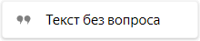
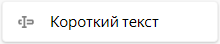
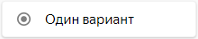
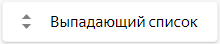
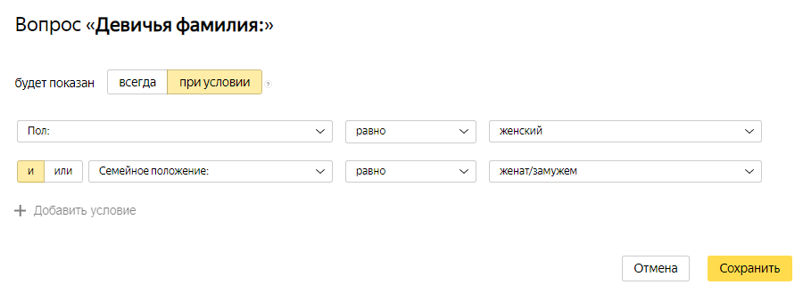
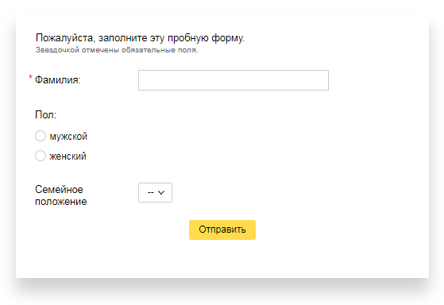

# Как создать первую форму

Начните знакомство с сервисом с создания простой формы:

1. [Добавьте на форму вопросы, на которые будут отвечать пользователи](#create-form).

1. [Опубликуйте форму и попросите пользователей ее заполнить](#publish).

1. [Получите таблицу с ответами пользователей](#get-answers).

1. [Настройте доступ к форме](#access).

## Шаг 1. Создайте форму {#create-form}

1. 

1. На верхней панели нажмите кнопку **Создать форму**.

1. Из списка слева выберите блоки и расположите их на форме в следующем порядке:
    
    № | Блоки | Настройки
    ----- | ----- | -----
    1 |  | Введите текст: `Пожалуйста, заполните эту пробную форму.` Добавьте комментарий: ` Звездочкой отмечены обязательные поля.`
    2 |  | Введите вопрос: ` Фамилия:` Включите опцию **Обязательный вопрос**.
    3 |  | Введите вопрос: `Пол:` Добавьте ответы:<ul><li>`мужской`<li>`женский`<ul/>
    4 |  | Введите вопрос: `Семейное положение:` Добавьте ответы:<ul><li>`холост`<li>`женат/замужем`<ul/>
    5 |  | Введите вопрос: `Девичья фамилия:`
    
1. Настройте условия появления вопроса <q>Девичья фамилия</q>:

    1. Наведите указатель на блок <q>Девичья фамилия</q> и нажмите появившийся значок .

    1. Добавьте два условия и заполните поля, как показано на рисунке:
        
        

    Теперь этот вопрос появится в форме только при условии, что в предыдущих вопросах выбран женский пол и семейное положение — <q>женат/замужем</q>.

## Шаг 2. Опубликуйте форму {#publish}

Чтобы пользователи могли заполнять форму, ее нужно опубликовать:

1. Нажмите кнопку **Поделиться**.

1. Чтобы скопировать ссылку на форму, в поле **Ссылка** нажмите значок .

1. Вставьте ссылку в адресную строку браузера и перейдите по ней. Если вы все сделали правильно, откроется новая форма:
    
    

1. Отправьте ссылку на форму пользователям.

## Шаг 3. Получите ответы на вопросы {#get-answers}

Чтобы получить таблицу с ответами пользователей на вопросы формы:

1. Перейдите на вкладку **Ответы**.

1. В списке **Скачать ответы на вопросы** включите опцию **Все**.

1. В списке **В формате** выберите опцию **XLSX**.

1. В списке **Фильтр по дате ответа** выберите опцию **За все время**.

1. Нажмите кнопку **Скачать**.



## Шаг 4. Настройте доступ к форме {#access}

По умолчанию редактировать форму может только автор. Если вы используете [{{ forms-full-name }} для бизнеса](forms-for-org.md), вы можете [дать доступ](access.md) к редактированию формы или группы форм сотрудникам вашей организации. 

