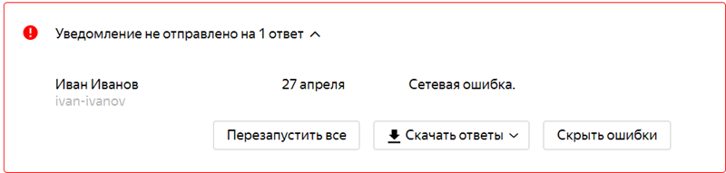

# Отправить письмо

В форме можно настроить интеграцию с Почтой, чтобы автоматически отправлять уведомление при заполнении формы.

## Настроить уведомления {#setup}

1. Выберите форму и перейдите на вкладку **Интеграция**.

1. Выберите [группу действий](notifications.md#add-integration), в которой вы хотите настроить отправку письма, и внизу группы нажмите кнопку .

1. В блоке **Отправить письмо** заполните поля:

    - **Кому** — адрес, на который будет отправлено уведомление. Можно перечислить несколько адресов через запятую или указать переменную.

        - Чтобы уведомление пришло на почту автора формы, выберите переменную **Email автора формы**.

        - Чтобы уведомление пришло на почту аккаунта на Яндексе, с которого пользователь заполнил форму, выберите переменную **Электронная почта**.

        - Чтобы уведомление пришло на адрес, указанный пользователем в ответ на вопрос, добавьте переменную **Ответ на вопрос** и выберите вопрос типа <q>Почта</q>.

    

    - **От кого** — адрес почтового ящика, с которого будет отправлено уведомление. Указывайте в этом поле только адреса на разрешенных доменах:

        - `market.yandex.ru`;

        - `contest.yandex.ru`;

        - `o.yandex.ru`;

        - `support.yandex.ru`;

        - `yandex-team.ru`;

        - `forms.yandex.ru`.

        Если в поле используется [переменная](vars.md), ее содержимое также должно быть адресом на разрешенном домене. Если поле не заполнено, письмо будет отправлено с адреса по умолчанию. Если указан адрес на домене, который не входит в список разрешенных, то уведомление не будет отправлено.

    

    - **Отправитель** — имя отправителя, которое увидит получатель письма.

    - **Обратный адрес** — почтовый адрес, на который получатель может отправить ответ на письмо. Если обратный адрес не указан, вы не сможете получить ответ.

    - **Тема** — тема письма.

    - **Текст** — текст письма.

    

    - При необходимости добавьте в сообщение заголовки. Для каждого заголовка укажите имя и значение.

    
    
    В любое поле можно вставить ответ на вопрос или другие данные из формы:

    - Выберите поле и справа нажмите кнопку **Переменные**.

    - Выберите в списке [переменную](vars.md), которую нужно добавить в поле. Например, в текст письма можно добавить обращение к пользователю по имени или [результат теста](tests.md).
    
    

1. При необходимости прикрепите к письму файл.

1. Чтобы после заполнения формы показать пользователю сообщение об отправленном письме, под заголовком действия включите опцию **Показывать результат пользователю**.

1. Нажмите кнопку **Сохранить**.

Чтобы отправить несколько почтовых уведомлений одновременно, добавьте их с помощью кнопки  внизу группы действий.

Если нужно отправлять уведомление, только когда пользователь ответил на вопросы определенным образом, [задайте условия](notifications.md#section_xlw_rjc_tbb).

> Пример уведомления для формы с анкетой на вакансию. После заполнения формы ответы на вопросы анкеты будут отправлены на почтовую рассылку отдела кадров.
>
> 

## Решение проблем {#troubleshooting}

Если вы настроили отправку уведомлений на почту, но после заполнения формы письма не приходят, проверьте папку со спамом и ошибки при отправке писем.

### Проверьте, попало ли письмо в спам
Если на вашу почту не приходят уведомления, проверьте папку <q>Спам</q>. Для писем от сервиса {{ forms-full-name }}, которые попали в спам, поставьте отметку <q>Не спам</q>.

Если вы используете собственный почтовый сервер, добавьте в <q>белый список</q> адрес отправителя: `идентификатор_формы@forms-mailer.yaconnect.com`.

### Проверьте текст письма

Почтовый сервер может заблокировать письмо, если его текст отсутствует или похож на спам. Заполните или отредактируйте текст письма. 

### Проверьте ошибки при отправке писем
1. Откройте форму, в которой не работают уведомления, и перейдите на вкладку **Интеграция**.

1. Проверьте, появилось ли в настройках вашего уведомления сообщение об ошибке.

    

1. Если сообщение об ошибке отображается:
    
    1. [Сделайте снимок экрана]({{ support-troubleshooting-screen }}).
    
    1. [Отправьте обращение в службу поддержки {{ forms-full-name }}](feedback.md) и приложите к нему снимок ошибки.

### Если уведомлений в спаме и ошибок нет

Если вы не нашли уведомлений в папке <q>Спам</q> и ошибок на вкладке **Интеграция**, возможно, что письмо заблокировано на почтовом сервере получателя. Чтобы выяснить причину блокировки письма:

1. Откройте форму, в которой не работают уведомления, и перейдите на вкладку **Интеграция**.

1. В настройках уведомления в поле **Обратный адрес** укажите вашу личную или рабочую почту.

1. Когда очередное уведомление из формы будет заблокировано почтовым сервером, на указанный обратный адрес придет письмо с сообщением об ошибке. Скопируйте текст сообщения.

1. [Отправьте обращение в службу поддержки {{ forms-full-name }}](feedback.md) и добавьте в него полученное сообщение об ошибке.