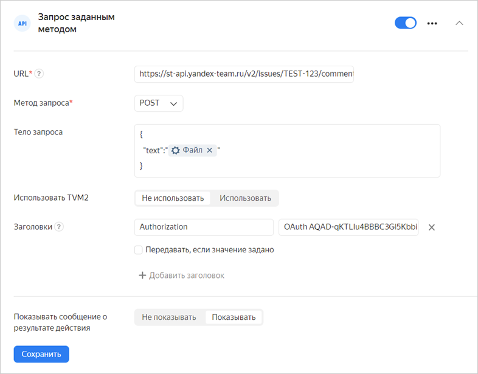
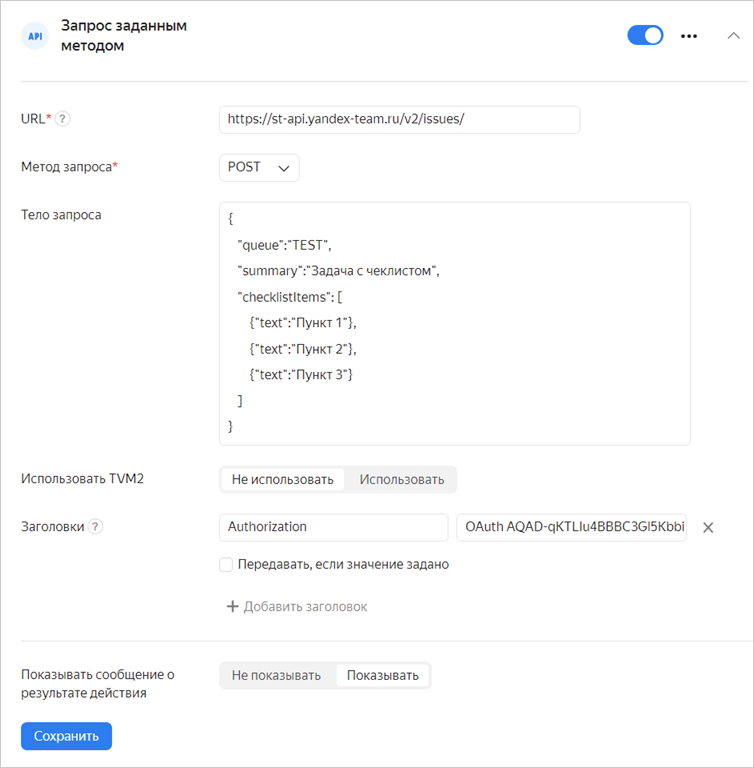

# Отправить HTTP-запрос





Для корректной работы HTTP-запросов необходимо разрешить вашему сервису принимать пакеты из сети {{ forms-full-name }} `2a02:6b8:c00::/40` по протоколу `ipv6`. В ином случае файрвол вашего сервиса может блокировать данные, передаваемые формой.





Чтобы передать данные из формы в веб-сервис через API, используйте HTTP-запросы:



1. Перед настройкой запросов [закажите доступ](https://puncher.yandex-team.ru/) из подсети {{ forms-name }} к вашему сервису: `_FORMS_BACK_PROD_NETS_` — для продакшена, `_FORMS_BACK_TEST_NETS_` — для тестинга.



1. Выберите форму и перейдите на вкладку **Интеграция**.

1. Выберите [группу действий](notifications.md#add-integration), в которую вы хотите добавить HTTP-запрос, и внизу группы нажмите кнопку с нужным типом запроса **API** и выберите тип запроса:

    - **Запрос JSON-RPC POST** — отправить запрос по протоколу JSON-RPC.

    

    - **Запрос методом POST** — отправить ответы пользователя в формате JSON или XML с помощью HTTP-запроса с методом POST.

    - **Запрос методом PUT** — отправить ответы пользователя в формате JSON или XML с помощью HTTP-запроса с методом PUT.

    

    - **Запрос заданным методом** — отправить любые доступные данные формы с возможностью задать формат запроса и выбрать HTTP-метод.

    

    Все запросы выполняются асинхронно.

    

1. Укажите URL сервиса — адрес узла, предоставляющего API.



1. При необходимости настройте аутентификацию с помощью [TVM2](https://wiki.yandex-team.ru/passport/tvm2/):

    

    Настроить аутентификацию c помощью TVM может пользователь с ролью `tvm_manager` или `form_manager` в сервисе ABC, с которым связан указанный Client ID приложения.

    

    1. Включите опцию **Использовать TVM2**.

    1. В поле **Client ID** укажите ID вашего TVM-приложения.

    1. В вашем сервисе разрешите принимать TVM-тикеты от {{ forms-name }}. Информацию о TVM-приложениях {{ forms-name }} можно посмотреть в [сервисе ABC](https://abc.yandex-team.ru/services/forms/resources/?supplier=14&type=47&state=requested&state=approved&state=granted&view=consuming): приложение forms — для продакшена, приложение forms-testing — для тестинга.



1. Задайте параметры, которые зависят от выбранного типа запроса:

    - Запрос JSON-RPC POST

        - Укажите метод сервиса, в который отправляется запрос.

        - Задайте параметры запроса. Для каждого параметра укажите имя и значение. 

        - В качестве значений параметров можно использовать [переменные](vars.md). В этом случае включите опцию **Передавать, если значение задано**.

    

    - Запрос методом POST/PUT

        - Выберите вопросы, ответы на которые требуется оправлять в запросе.

        - Выберите формат запроса: JSON или XML.

        - При необходимости добавьте в запрос заголовки. Для каждого заголовка укажите имя и значение. 

        - В качестве значений заголовков можно использовать [переменные](vars.md). В этом случае включите опцию **Передавать, если значение задано**.

    

    - Запрос заданным методом

        - Выберите HTTP-метод.

        - Задайте тело запроса: укажите передаваемые параметры в формате JSON. Чтобы добавить в тело запроса данные из формы, используйте [переменные](vars.md).

        - Добавьте в запрос заголовки. Для каждого заголовка укажите имя и значение. 

        - В качестве значений заголовков можно использовать [переменные](vars.md). В этом случае включите опцию **Передавать, если значение задано**.

1. Нажмите кнопку **Сохранить**.

> Пример: создать проект в {{ tracker-full-name }} с заданным названием и ключом очереди.
>
> Создайте запрос к [API {{ tracker-name }}](../tracker/about-api.md), заполнив форму следующим образом:
>
>* **URL** — `https://st-api.yandex-team.ru/v2/projects``https://api.tracker.yandex.net/v2/projects`.
>* **Метод запроса** — `POST`.
>* **Тело запроса** — параметры проекта в формате JSON:
>
>   ```json
>
>       {
>          "name": "Название проекта",
>          "queues": "<ключ очереди>"
>       }
>    ```
>
>* **Заголовки**:
>  `Authorization` — `OAuth <ваш OAuth-токен>`;
>  
   `X-Org-ID` — `<идентификатор организации>`.
   
>
> 

## Обработка ответов на HTTP-запросы POST/PUT/ заданным методом {#http-response}

**Успешный запрос**

Запрос считается успешным, если получен ответ с кодом `200`, `201` или `202`.

**Обработка ошибок**

При возникновении следующих ошибок запрос будет отправлен повторно (до 7 попыток в течение 30 минут):

- Истечение таймаута (5 секунд).

- Сетевая ошибка.

- Ответ с кодом `5XX`.

- Ответ с кодом `404`.

Все другие ошибки приводят к неуспешному завершению интеграции.

**Редирект**

Если получен ответ с кодом `307`, то запрос будет перенаправлен на URL, указанный в заголовке `Location`.

## Обработка ответов на запрос JSON-RPC POST {#json-response}

**Успешный запрос**

Запрос считается успешным при отсутствии перечисленных ниже ошибок.

**Редирект**

Если получен ответ с кодом `307`, то запрос будет перенаправлен на URL, указанный в заголовке `Location`.

**Обработка ошибок**

Обработка ошибок происходит в следующем порядке:

1. Если ответ не получен из-за сетевой ошибки или по истечении таймаута, запрос будет отправлен повторно.

1. Проверяется тело ответа. Если тело ответа содержит ошибку, запрос будет отправлен повторно при любом коде ошибки, кроме:

    - `-32700` Parse error

    - `-32600` Invalid Request

    - `-32602` Invalid params

1. Если тело ответа не содержит ошибок, проверяется код состояния HTTP. Запрос будет отправлен повторно при кодах состояния `5XX` и `404`.

Все другие ошибки приводят к неуспешному завершению интеграции.

## Решение проблем {#filters}

### На один ответ в форме отправляется два HTTP-запроса {#duplicated-requests}

В некоторых случаях модуль отправки HTTP-запросов может не дождаться ответа от внешнего сервиса о том, что запрос принят. В этом случае запрос будет отправлен повторно, и в сервис придет дубликат запроса с теми же данными. Если требуется отслеживать уникальность HTTP-запросов, воспользуйтесь значением заголовка `x-delivery-id`.



### Из переменных подставляются данные в неверном формате {#incorrect-format}

Если вы добавляете в запрос данные из формы с помощью [переменных](vars.md), в тело запроса могут попасть недопустимые символы и вызвать ошибку интеграции. Чтобы удалить из ответа недопустимые символы или преобразовать формат ответа, настройте [фильтры для переменных](vars.md#var-filters).

Например, нужно добавить в тело запроса переменную, содержащую ответ на вопрос <q>Длинный текст</q>. Если в тексте ответа будут переводы строки, это вызовет ошибку интеграции. Чтобы избежать ошибки, нужно преобразовать значение переменной в формат JSON.

Для этого при добавлении переменной выберите фильтр **JSON**.


### Не получается прикрепить файл к задаче в {{ tracker-full-name }} {#no-files}

Если требуется прикрепить файл из ответа на вопрос формы к задаче в {{ tracker-short-name }} через API, проще всего добавить файл в комментарий. Для этого создайте **Запрос заданным методом** с параметрами:

- URL: `https://st-api.yandex-team.ru/v2/issues/<ключ_задачи>/comments`

- Метод запроса: **POST**

- Тело запроса: добавьте в тело запроса переменную <q>Ответ на вопрос</q> и выберите вопрос типа <q>Файл</q>. 

    ```
    {
        "text":"<переменная с ответом на вопрос>"
    }
    ```

- Заголовки: `Authorization: OAuth <токен>`

    

### Не получается создать в {{ tracker-full-name }} задачу с чеклистом {#resolve-problems-checklist}

Чтобы создать в {{ tracker-short-name }} задачу с чеклистом, используйте интеграцию **Запрос заданным методом** с параметрами:

- URL: `https://st-api.yandex-team.ru/v2/issues`

- Метод запроса: **POST**

- Тело запроса: укажите параметры задачи в формате JSON. Например:

    ```
    {"queue":"<Ключ_очереди>",
    "summary":"Заголовок задачи",     
    "checklistItems":[                     
        {"text":"Пункт 1"},
        {"text":"Пункт 2"},
        {"text":"Пункт 3"}]
    }
    ```

    Чтобы добавить в тело запроса данные из формы, используйте [переменные](vars.md). Например, чтобы автором задачи стал пользователь, заполнивший форму, в качестве значения параметра `createdBy` добавьте переменную

    

    Параметры задачи `queue` и `summary` являются обязательными. Подробнее структура запроса описана [в документации {{ tracker-name }}](https://docs.yandex-team.ru/cloud/tracker/concepts/issues/create-issue).

    

    

    

### Ошибка 400 Client Error: Bad request {#error-400}

Если интеграция завершилась ошибкой <q>400 Client Error: Bad request</q>, проверьте URL-адрес и тело запроса на опечатки: лишние переносы, неразрывные пробелы, экранирование. Тело запроса должно быть в формате JSON.
