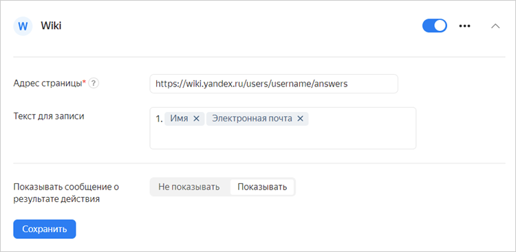

# Добавить ответ на {{ wiki-name }}



Интеграцию с {{ wiki-name }} могут настроить пользователи [{{ forms-full-name }} для бизнеса](forms-for-org.md).



В форме можно настроить интеграцию с [{{ wiki-name }}]({{ link-wiki }}), чтобы сохранять ответы пользователей на вики-странице. Например, если вы используете форму для регистрации участников мероприятия, можно автоматически сохранять список участников на {{ wiki-name }}. Подробнее о вики-страницах читайте в [документации {{ wiki-name }}](../wiki/pages-types.md).



Интеграция не сработает, если к странице на {{ wiki-name }} ограничен доступ пользователей. В этом случае [предоставьте доступ](../wiki/page-management/access-setup.md) к вашей странице служебному аккаунту `@yndx-wiki-cnt-robot`.



Настройка отправки ответов на {{ wiki-name }} различается в зависимости от того, куда нужно добавить ответ: на [страницу {{ wiki-name }}](#editor) или в [динамическую таблицу](#grid).

## Добавление ответов на страницу {#editor}

Чтобы настроить добавление ответов из формы на страницу {{ wiki-name }}:

1. Выберите форму и перейдите на вкладку **Интеграция**.

1. Выберите [группу действий](notifications.md#add-integration), в которой вы хотите настроить отправку ответов на {{ wiki-name }}, и внизу группы нажмите кнопку  **{{ wiki-name }}**.

1. Укажите адрес вики-страницы, на которую будут отправляться данные из формы. Например: `users/login/my-page`. По умолчанию ответ добавляется в конец страницы. Чтобы добавлять ответы в определенное место на странице:

    1. Вставьте в текст страницы [якорь](../wiki/actions/anchor.md) в том месте, куда нужно добавлять ответы из формы. Например, `{{a name="form"}}`.
        
    1. В настройках интеграции с {{ wiki-name }} добавьте к адресу страницы символ `#` и имя якоря: `users/login/my-page#form`. Ответы из формы будут добавляться на страницу после якоря.

1. В поле **Текст** укажите, какие данные нужно добавлять на страницу. Вы можете оформить текст с помощью [вики-разметки](../wiki/static-markup.md). 
Вы можете добавить в текст ответ на вопрос или другие данные из формы:
    
    1. Выберите поле и справа нажмите значок .
    
    1. Выберите в списке [переменную](vars.md), которую нужно добавить в поле. Например, вы можете добавить в текст страницы имя пользователя и его почту.
    
    

1. Чтобы после заполнения формы пользователь получил ссылку на вики-страницу, под заголовком действия включите опцию **Показывать сообщение о результате действия**.

1. Нажмите кнопку **{{ ui-key.yacloud.common.save }}**.

## Динамическая таблица {#grid}

Чтобы настроить добавление ответов из формы в динамическую таблицу {{ wiki-name }}:

1. Выберите форму и перейдите на вкладку **Интеграция**.

1. Выберите [группу действий](notifications.md#add-integration), в которой вы хотите настроить отправку ответов на {{ wiki-name }}, и внизу группы нажмите кнопку  **{{ wiki-name }}**.

1. Укажите адрес динамической таблицы, на которую будут отправляться данные из формы. Адрес указывается без домена. Например: `users/login/my-page`. 

1. В поле **Выбрать действие** укажите, в какую таблицу добавить данные.

1. В блоке **Данные для записи** выберите столбец, в который нужно добавлять записи. Вы можете выбрать больше одного столбца. Ниже укажите, какие данные нужно добавлять в таблицу. В тексте можно использовать [вики-разметку](../wiki/static-markup.md). Чтобы добавить в текст ответ на вопрос или другие данные из формы:
    
    1. В поле с текстом столбца нажмите значок .
    
    1. Выберите в списке [переменную](vars.md), которую нужно добавить в поле. Например, вы можете добавить в текст имя пользователя и его почту.

1. В поле **Добавить ответ на страницу** выберите, куда будут добавляться новые строки — в начало или в конец таблицы.

1. Чтобы после заполнения формы пользователь получил ссылку на вики-страницу, под заголовком действия включите опцию **Показывать сообщение о результате действия**.

1. Нажмите кнопку **{{ ui-key.yacloud.common.save }}**.

Чтобы отправлять ответы на несколько вики-страниц одновременно, добавьте несколько действий с помощью кнопки  **{{ wiki-name }}** внизу страницы.

Если нужно отправлять данные на {{ wiki-name }}, только когда пользователь ответил на вопросы определенным образом, [задайте условия](notifications.md#section_xlw_rjc_tbb).