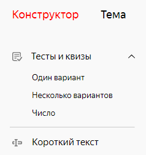
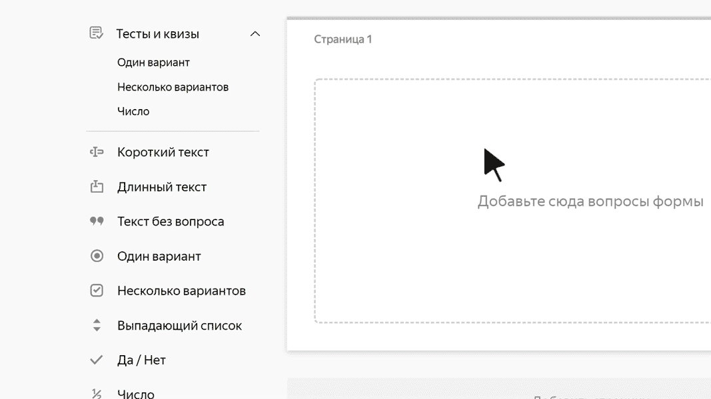

# Провести тест

С помощью сервиса {{ forms-full-name }} вы можете провести тест, квиз или викторину. Это может быть тест для проверки знаний по какой-либо теме или шуточный квиз, которым можно поделиться в соцсетях. За правильные ответы пользователи будут получать баллы, а после завершения теста увидят свой результат.

## Добавить вопросы для теста {#test-questions}

Чтобы создать тест, добавьте на форму блоки вопросов из категории **Тесты и квизы**:

1. Откройте форму или [создайте новую](new-form.md).

1. Выберите форму и перейдите на вкладку **Конструктор**.

1. Чтобы добавить вопрос для теста, на левой панели в разделе **Тесты и квизы** выберите блок и перетащите его в рабочую область.
    
    
    
1. В открывшемся окне **Редактирование вопроса** задайте параметры блока:

    1. В поле **Вопрос** напишите формулировку вопроса.

    1. Для вопросов типа **Один вариант** и **Несколько вариантов** задайте варианты ответов.

    1. Укажите правильные ответы и количество баллов, которые за них получит пользователь. У вопросов типа **Один вариант** и **Несколько вариантов** правильных ответов может быть несколько.

    1. В блоке **Настройки** при необходимости сделайте вопрос обязательным или настройте сортировку ответов. Подробнее о параметрах вопросов для тестов читайте в разделе [{#T}](blocks-ref/tests-ref.md).

1. Аналогичным образом добавьте на форму нужное количество вопросов и настройте ответы.

1. Чтобы изменить порядок вопросов, наведите указатель на блок и перетащите его за значок  на нужное место.
    
    

1. Если нужно показывать или скрывать блок в зависимости от ответов пользователя на другие вопросы, [настройте условия показа блока](add-questions.md#conditions).

1. Настройте [правила подсчета результатов теста](#test-result).

1. [Опубликуйте ваш тест](publish.md). 

## Настроить подсчет результатов {#test-result}

После завершения теста можно показать пользователю количество набранных баллов и результат. Вы можете выбрать один из двух способов подсчета результата:

- Двухуровневый — зачет или незачет. 

- Многоуровневый — распределение результатов по сегментам. Например: <q>профессионал</q>, <q>любитель</q> и <q>новичок</q>.

Чтобы настроить правила подсчета результатов:

1. Выберите форму и перейдите на вкладку **Настройки** → **Тесты и квизы**.

1. Включите опцию **Показывать результат прохождения теста**.
    
    
    
    Если вы включите показ результатов теста, при отправке формы не будут работать [переход на сайт](success-page.md#sec_redirect) и показ [сообщения](success-page.md#message), которые можно настроить на вкладке **Настройки** → **Тексты и логика отправки**.

    

1. Выберите способ подсчета результата:

    - **По сегментам** — для многоуровневой оценки. При выборе этого варианта задайте количество сегментов (уровней оценки). Количество баллов, которое нужно набрать для каждого сегмента, будет определено автоматически.

    - **Зачёт/Незачёт** — для двухуровневой оценки. При выборе этого варианта укажите минимальное количество баллов, которое нужно набрать для зачета.

1. Для каждого сегмента (либо для зачета и незачета) задайте текст, который увидит пользователь, если его результат попадет в этот сегмент:

    - Введите заголовок, например: <q>Вы заядлый путешественник!</q>

    - Напишите комментарий. Например, посоветуйте, что почитать, чтобы улучшить результат. Чтобы форматировать текст комментария, используйте [разметку Markdown](appearance.md#section_pzm_m1j_j3b).

    - Чтобы прикрепить иллюстрацию, нажмите значок .

1. Нажмите кнопку **{{ ui-key.yacloud.common.save }}**.



Если вопросы из категории **Тесты и квизы** объединить в [серию вопросов](blocks-ref/series.md), то подсчет баллов в тесте не сработает.



## Показать правильные и неправильные ответы {#show-right-answ}

После завершения теста можно показать пользователю правильные и неправильные ответы:

1. Выберите форму и перейдите на вкладку **Настройки** → **Тесты и квизы**.

1. Включите опцию **Показывать результат прохождения теста**.

1. Включите опцию **Показывать правильные и неправильные ответы в результатах теста**.

1. Нажмите кнопку **{{ ui-key.yacloud.common.save }}**.

После завершения теста пользователь может нажать кнопку **{{ ui-key.forms.common.blocks_quiz-result.correct-answers }}**. Откроется страница, где будут показаны баллы и выделены правильные и неправильные ответы.

## Посмотреть ответы пользователей {#right-answ-separately}

Если после завершения теста вы хотите проверить, на какие вопросы пользователи ответили правильно или неправильно, перейдите в просмотр [отдельных ответов.](answers.md#answer-in-detail) Верные и неверные ответы будут подсвечены разными цветами.
