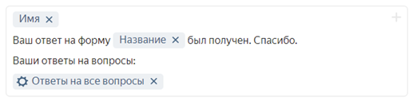
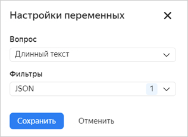

# Переменные в настройках интеграции

При настройке интеграции формы с другими сервисами вы можете передавать в сервис ответы на вопросы или другие данные из формы. Например, можно вставить ответы пользователя в текст письма или записать данные в поля задачи в {{ tracker-short-name }}.

Для этого используйте переменные:

1. В форме на вкладке **Интеграции** [добавьте действие](notifications.md#add-integration). 

1. Выберите поле и справа нажмите значок .

1. Выберите в списке переменную, которую нужно добавить в поле.

1. Если вы используете переменные <q>Ответ на вопрос</q>, <q>Идентификатор варианта ответа на вопрос</q> и подобные,  при необходимости выберите [фильтр](#var-filters) для значения переменной.

1. Нажмите кнопку **Сохранить**.

При отправке данных в сервис переменная автоматически преобразуется в значение — ответ на вопрос, результат теста или технические данные.



Чтобы при [интеграции с {{ tracker-short-name }}](create-task.md) добавить в поля **Автор**, **Исполнитель**, **Наблюдатели** сотрудника, указанного в ответе на вопрос типа <q>Люди</q>, добавьте в поле переменную **Идентификатор варианта ответа на вопрос**. Если вы используете переменную **Ответ на вопрос**, интеграция не сработает.



> Пример: текст письма, содержащий все ответы пользователя на вопросы формы.
>
> 

## Фильтры {#var-filters}

Если в настройки интеграции с помощью переменных подставлены ответы на вопросы, могут возникнуть ошибки из-за того, что ответ не соответствует формату, который требуется для интеграции. Например, если в тело HTTP-запроса добавить ответ на вопрос <q>Длинный текст</q>, содержащий переводы строк, интеграция не сработает.

Чтобы избежать ошибок, связанных с форматом данных, используйте фильтры для переменных:

* **Sanitize string** — удаляет из текста ответа специальные символы.

* **JSON** — преобразует текст ответа в формат, совместимый с JSON.

* **base64** — преобразует текст ответа в кодировку ASCII.

## Форматирование ответов {#formatting-responses}

Если в настройках интеграции с помощью переменных вы используете ответы на вопросы, вы можете выбрать формат ответов, которые будут отправлены после заполнения формы.

* **Простой текст** — отобразит данные в формате "вопрос - ответ".

* **Форматированный** — поместит в блок кода вопросы и ответы.

* **JSON** — отобразит ответ в формате `"ключ": "значение"`.

## Справочник переменных {#section_wqx_1j2_p2b}

В настройках действий можно использовать следующие переменные:

Переменная | Описание
----- | -----
**Данные пользователя** | Личные данные пользователя, заполнившего форму   Переменные из этой группы преобразуются в персональные данные пользователя только в том случае, если форма создана в [{{ forms-full-name }} для бизнеса](forms-for-org.md) и заполнивший форму пользователь является сотрудником организации. Данные внешних пользователей можно получить, только если пользователи укажут свои данные в ответ на вопросы формы.
Имя | Имя пользователя
Логин | Логин пользователя
Электронная почта | Почта пользователя
Пол | Пол пользователя
Отдел | Отдел, к которому относится сотрудник (для пользователей [{{ forms-full-name }} для бизнеса](forms-for-org.md))
Телефон | Рабочий телефон сотрудника (для пользователей [{{ forms-full-name }} для бизнеса](forms-for-org.md))
Руководитель | Непосредственный руководитель сотрудника (для пользователей [{{ forms-full-name }} для бизнеса](forms-for-org.md))
Команда | Команды, в которых состоит сотрудник (для пользователей [{{ forms-full-name }} для бизнеса](forms-for-org.md))
**Данные из организации** | Информация из адресной книги организации в [{{ org-full-name }}]({{ link-org-main }})
Инфо о пользователе | Одно из полей карточки сотрудника, заполнившего форму
Инфо из ответа на вопрос | Для вопросов типа **Люди**, **Отделы** и **Команды** — одно из полей карточки сотрудника или подразделения, указанных в ответе. 
**Результаты теста** | Результат прохождения [теста или квиза](tests.md)
Максимум баллов в тесте | Максимальное количество баллов, которое можно набрать в тесте
Всего вопросов с баллами | Количество вопросов, за которые можно получить баллы
Набрано баллов | Количество баллов, набранных пользователем
Заголовок результатов теста | [Заголовок для сегмента](tests.md#test-result), в который попал результат пользователя
Описание результатов теста | [Описание для сегмента](tests.md#test-result), в который попал результат пользователя
Набрано баллов на вопросе | Количество баллов, которое получено за выбранный вопрос
**Форма** | Параметры формы и ответы на ее вопросы
ID формы | Уникальный идентификатор формы
Название | Название формы
Ответ на вопрос | Ответ пользователя на определенный вопрос формы — выберите вопрос
Ответы на вопросы | Ответы пользователя на несколько вопросов формы — выберите вопросы и настройте форматирование ответов
ID ответа | Уникальный идентификатор заполненной формы
Идентификатор варианта ответа на вопрос | Уникальный идентификатор варианта ответа для вопросов с выбором вариантов (например, <q>Люди</q> или <q>Выпадающий список</q>).
Дата ответа | Дата заполнения формы
Email автора формы | Почта пользователя, который создал форму
**Браузер** | Информация о браузере и операционной системе пользователя
Семейство ОС | Тип операционной системы
Название ОС | Название операционной системы
Версия ОС | Версия операционной системы
Название браузера | Название
Версия браузера | Версия
**Запрос** | Технические параметры HTTP-сессии
Хост | Имя компьютера пользователя
URL | Адрес формы
Все GET-параметры | Значения всех параметров запроса.  Читайте подробнее, как [использовать GET-параметры для предзаполнения формы](get-params.md).
GET-параметр | Значение определенного параметра запроса — укажите имя параметра.  Читайте подробнее, как [использовать GET-параметры для предзаполнения формы](get-params.md).
