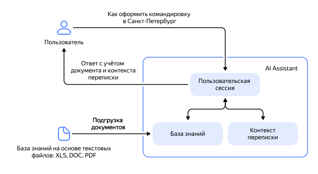

# {{ assistant-api }}



{{ assistant-api }} — это инструмент создания AI-ассистентов. С его помощью можно создать персонализированных помощников, реализовывать сценарий генеративного ответа с учетом информации из внешних источников (RAG, Retrieval Augmented Generation), а также сохранять контекст запросов к модели.

Вы можете создать своего AI-ассистента с помощью [{{ ml-sdk-full-name }}](../../sdk/index.md) или реализуя запросы к API на языке программирования.

Чтобы использовать {{ assistant-api }} в {{ foundation-models-full-name }}, необходимы [роли](../../security/index.md#service-roles) `ai.assistants.editor` и `ai.languageModels.user` или выше на [каталог](../../../resource-manager/concepts/resources-hierarchy.md#folder).

## Из чего состоят AI-ассистенты {#content}

{{ assistant-api }} предоставляет несколько абстракций для реализации чат-ботов и AI-ассистентов. 

[_Ассистент_](../../assistants/api-ref/grpc/Assistant/index.md) определяет, к какой модели нужно обратиться, а также какие параметры и инструкции использовать. Это позволяет настроить модель один раз и использовать эти настройки в будущем без необходимости каждый раз передавать их.

Для хранения контекста истории общения используются [_треды_](../../threads/api-ref/grpc/index.md). Каждый тред — это отдельный диалог с пользователем. [_Запустив_](../../runs/api-ref/grpc/index.md) ассистента для треда, вы вызовете модель и передадите весь сохраненный в нем контекст. Вы можете [получить](../../operations/assistant/request-chunked-response.md) промежуточные результаты генерации, [прослушивая](../../runs/api-ref/grpc/Run/listen.md) текущий запуск, а итоговый результат генерации будет добавлен к треду.



По умолчанию при каждом запуске модель будет обрабатывать содержимое треда заново. Если в треде хранится большой контекст, а вы запускаете ассистента после каждого сообщения от пользователя, стоимость работы ассистента может стать существенной. Чтобы оптимизировать расходы, попробуйте ограничить размер передаваемого контекста с помощью параметра [`customPromptTruncationOptions`](../../runs/api-ref/grpc/Run/create.md) при запуске.

Подробнее о стоимости использования ассистентов см. [Правила тарификации ассистентов](../../pricing.md#rules-assistant).



### Работа с внешними источниками информации {#files}

Чтобы модель использовала внешние источники информации для ответов на запросы, вы можете загрузить файлы с дополнительной информацией с помощью [Files API](../../files/api-ref/grpc/index.md) и [создать](../../searchindex/api-ref/grpc/SearchIndex/create.md) для них [_поисковый индекс_](./search-index.md). Загрузить можно до 1 000 файлов, максимальный размер каждого файла — 128 МБ. Один и тот же файл может содержаться в нескольких поисковых индексах сразу. На стадии Preview поисковый индекс может содержать до 100 файлов.

Со всеми ограничениями {{ assistant-api }} можно ознакомиться в разделе [{#T}](../limits.md).

Для загрузки поддерживаются следующие [MIME-типы](https://en.wikipedia.org/wiki/Media_type): 

* `application/json`
* `application/msword`
* `application/pdf`
* `application/vnd.ms-excel`
* `application/vnd.ms-excel.sheet.2`
* `application/vnd.ms-excel.sheet.3`
* `application/vnd.ms-excel.sheet.4`
* `application/vnd.ms-excel.workspace.3`
* `application/vnd.ms-excel.workspace.4`
* `application/vnd.ms-outlook`
* `application/vnd.ms-powerpoint`
* `application/vnd.ms-project`
* `application/vnd.ms-word2006ml`
* `application/vnd.openxmlformats-officedocument.spreadsheetml.sheet`
* `application/vnd.openxmlformats-officedocument.wordprocessingml.document`
* `application/x-latex`
* `application/x-ms-owner`
* `application/xhtml+xml`
* `text/csv`
* `text/html`
* `text/markdown`
* `text/plain`
* `text/xml`
* `application/rtf`



Время хранения загруженных файлов и поисковых индексов ограничено. Вы можете настроить его при загрузке файла с помощью параметра [ExpirationConfig](../../files/api-ref/grpc/File/create.md#yandex.cloud.ai.common.ExpirationConfig). По умолчанию файлы будут удалены, если в течение 7 дней они не используются.



При создании поискового индекса вы задаете [тип поиска](./search-index.md#search-types), для которого индекс будет использоваться. Поддерживаются [полнотекстовый](./search-index.md#text-search), [векторный](./search-index.md#vector-search) и [гибридный](./search-index.md#hybrid-search) типы поиска. Скорость индексирования зависит от типа и размера файлов, а также нагрузки в сервисе и может занять от нескольких секунд до нескольких часов. Файлы индексируются [асинхронно](../index.md#working-mode). В ответ на запрос создания поискового индекса возвращается идентификатор [операции](../../../api-design-guide/concepts/async.md). По нему вы можете узнать, когда поисковый индекс будет готов.

Созданный поисковый индекс можно подключить к ассистенту. Тогда при запуске модель будет учитывать содержимое поискового индекса и отвечать, используя в первую очередь информацию из него. 

### Подтверждение источников {#citations}

Если при формировании ответа AI-ассистент использует поисковые индексы с внешними источниками информации, то ответ модели содержит _ссылки на источники_ — секцию `citations` с информацией обо всех использованных при подготовке ответа индексах, внешних файлах и их фрагментах.

При работе через {{ ml-sdk-name }} ссылочную подтвержденность можно получить из свойства `citations` объекта `run`. Получить ссылки на источники через API можно по идентификатору запуска, воспользовавшись методом REST API [Run.Get](../../runs/api-ref/Run/get.md) или вызовом gRPC API [RunService/Get](../../runs/api-ref/grpc/Run/get.md). Кроме того, секция со ссылками на источники прикрепляется ко всем сообщениям ассистента, хранящимся в треде.

Структура секции `citations`, содержащей ссылки на источники:
* `sources` — массив из одного или более фрагментов файлов-источников, использованных при генерации ответа:

    * `chunk` — информация об использованном при генерации ответа фрагменте файла-источника:

        * `searchIndex` — блок полей с информацией о поисковом индексе, содержащем использованный фрагмент файла-источника. Блок содержит идентификатор, тип и другие метаданные индекса, а также информацию о его настройках.
        * `sourceFile` — блок полей с информацией об исходном файле-источнике, фрагмент которого использован при генерации ответа. Блок содержит идентификатор и другие метаданные файла.
        * `content` — блок полей, содержащий текст фрагмента, который использовался при генерации ответа.

Подробнее о структуре секции `citations` см. в [справочнике API](../../runs/api-ref/Run/create.md#yandex.cloud.ai.assistants.v1.runs.Run).



После построения поискового индекса вы можете удалять файлы. Однако в этом случае информация об источниках не сохранится, поэтому блок `source` вернется пустым. Если вы хотите использовать ссылки на источники, не удаляйте файлы, использовавшиеся для построения поискового индекса.



Примеры работы со ссылками на источники с помощью SDK и API, а также примеры вывода см. в разделе [Создать ассистента с поисковым индексом](../../operations/assistant/create-with-searchindex.md#create-assistant).

#### См. также {#see-also}

* [{#T}](../../operations/assistant/create.md)
* [{#T}](../../operations/assistant/create-with-searchindex.md)
* [{#T}](../../operations/assistant/request-chunked-response.md)