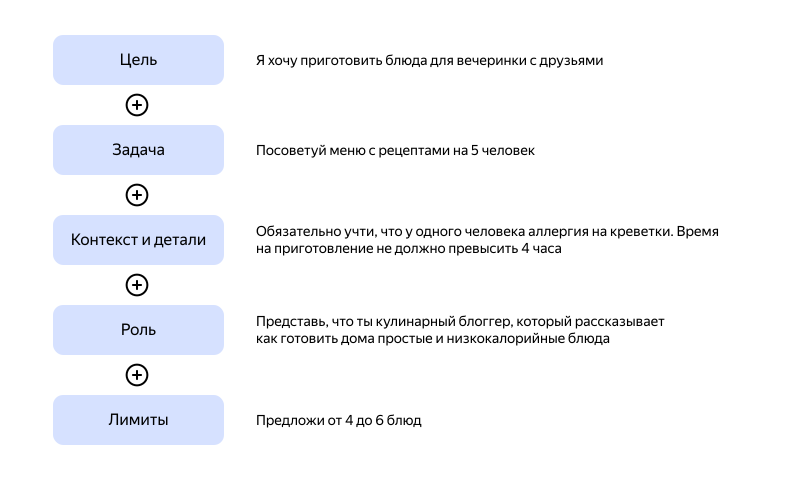

# Элементы промта



Промт может содержать следующие элементы:

* *Инструкция* — конкретная задача, требуемый стиль письма и другие предписания для модели.
* *Контекст* — внешняя информация или дополнительные уточнения, которые помогут получить лучший результат.
* *Входные данные* — данные для предсказаний или вопрос, на который мы хотим получить ответ.
* *Индикатор вывода* — тип или формат ожидаемых выходных данных.

Рассмотрим простой пример классификации текста, чтобы лучше понять элементы промта:

**Промт**

```text
Классифицируй текст как нейтральный, негативный или позитивный.

Текст: Я думаю, что еда была нормальной.

Настроение:
```

**Ответ**

```text
Нейтральное
```

В приведенном примере промта инструкция соответствует задаче классификации: «Классифицируй текст как нейтральный, негативный или позитивный». Входные данные представлены фразой «Я думаю, что еда была нормальной», а индикатор вывода — «Настроение:».

В этом примере не используется контекст, но его также можно добавить в промт. Например, контекст для этого промта классификации текста может включать примеры похожих вопросов и ответов, чтобы помочь модели лучше понять задачу и ожидаемые результаты. Также вы можете задать формат выходных данных, например, попросить модель заключить текст в кавычки или в формате JSON. Также вы можете указать целевую аудиторию или уровень знаний будущего читателя, чтобы модель учитывала это при генерации.

Не обязательно использовать все четыре элемента в каждом промте. Формат промта зависит от конкретной задачи.

#### См. также {#see-also}

* [{#T}](examples.md)