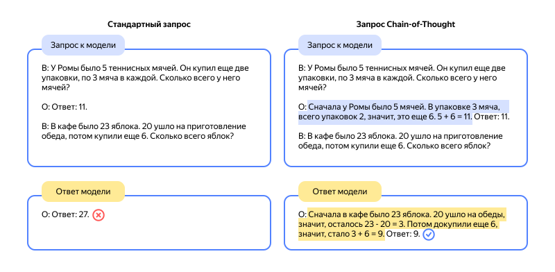
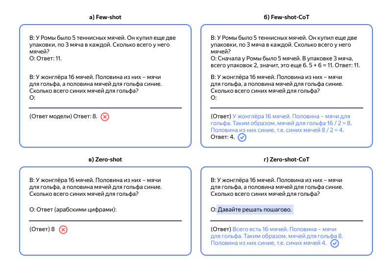
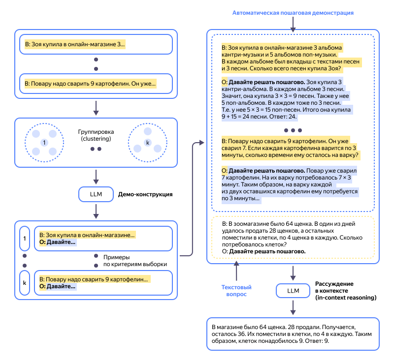

# Промтинг Chain-of-Thought (CoT)



Промтинг Chain-of-Thought (CoT), представленный в работе [Wei et al. (2022)](https://arxiv.org/abs/2201.11903), позволяет моделям типа {{ yagpt-name }} выполнять сложные задачи, требующие промежуточных шагов рассуждения. На популярных [бэнчмарках](https://habr.com/ru/articles/840530/) по школьной арифметике GSM8K и более сложных задачах MAWPS данный метод дает прирост в результатах 200% и 30%, соответственно. На данный момент методы промтинга [Few-shot](few-shot.md) и Chain-of-Thought дают наибольший прирост в широком спектре задач и конкурируют друг с другом за лидерство среди простых методов промт-инжиниринга.

## Промтинг Zero-shot CoT {#zero-shot-cot}



Промтинг Zero-shot CoT, представленный в работе [Kojima et al. (2022)](https://arxiv.org/abs/2205.11916), предполагает добавление фразы «Давайте подумаем шаг за шагом» к исходному промту. Как видно из статьи, этот метод увеличивает точность ответов от -10% до +100%, в зависимости от разных бэнчмарков. Попробуем решить простую задачу:

**Промт**

```
Я пошел на рынок и купил 10 яблок. Я отдал 2 яблока соседу и 2 ремонтнику. Затем я купил еще 5 яблок и съел 1. Сколько яблок у меня осталось?
```

**Ответ**

```
11 яблок
```

Ответ неверный. Попробуем использовать технику zero-shot CoT промтинга:

**Промт**

```
Я пошел на рынок и купил 10 яблок. Я отдал 2 яблока соседу и 2 ремонтнику. Затем я купил еще 5 яблок и съел 1. Сколько яблок у меня осталось?

Давайте подумаем шаг за шагом.
```

**Ответ**

```
Сначала у вас было 10 яблок.
Вы отдали 2 яблока соседу и 2 ремонтнику, так что у вас осталось 6 яблок.
Затем вы купили еще 5 яблок, так что теперь у вас 11 яблок.
Наконец, вы съели 1 яблоко, так что у вас осталось 10 яблок.
```

Такая простая инструкция сильно повысила точность ответа. Это особенно полезно, когда у вас нет большого количества примеров для использования в промте.

## Промтинг Few-shot CoT {#few-shot-cot}

Chain-of-Thought можно комбинировать с промтами [Few-shot](few-shot.md), чтобы улучшить результаты на сложных задачах. Рассмотрим простой арифметический пример:

**Промт**

```text
Нечетные числа в этой группе дают в сумме четное число: 4, 8, 9, 15, 12, 2, 1.
A: Сложив все нечетные числа (9, 15, 1), получаем 25. Ответ: Ложь.

Нечетные числа в этой группе дают в сумме четное число: 16, 11, 14, 4, 8, 13, 24.
A: Сложив все нечетные числа (11, 13), получаем 24. Ответ: Истина.

Нечетные числа в этой группе дают в сумме четное число: 17, 10, 19, 4, 8, 12, 24.
A: Сложив все нечетные числа (17, 19), получаем 36. Ответ: Истина.

Нечетные числа в этой группе дают в сумме четное число: 17, 9, 10, 12, 13, 4, 2.
A: Сложив все нечетные числа (17, 9, 13), получаем 39. Ответ: Ложь.

Нечетные числа в этой группе дают в сумме четное число: 15, 32, 13, 82, 7, 1.
A:
```

**Ответ**

```text
Сложив все нечётные числа (15, 13, 7, 1), получаем 36. Ответ: Истина.
```

Мы видим, что результат идеален, когда мы предоставляем шаги рассуждения. На самом деле для решения этой задачи достаточно даже одного примера:

**Промт**

```
Нечетные числа в этой группе дают в сумме четное число: 4, 8, 9, 15, 12, 2, 1.
A: Сложив все нечетные числа (9, 15, 1), получаем 25. Ответ: Ложь.

Нечетные числа в этой группе дают в сумме четное число: 15, 32, 5, 13, 82, 7, 1.
A:
```

**Ответ**

```
Сложив все нечетные числа (15, 5, 13, 7, 1), получаем 41. Ответ: Ложь.
```

Авторы техники утверждают, что такой способностью обладают только достаточно большие языковые модели.

## Автоматический Chain-of-Thought {#auto-cot}

Для эффективного промтинга Chain-of-Thought требуется ручное создание разнообразных примеров. Это большой труд, который может не окупиться. Авторы работы [Zhang et al. (2022)](https://arxiv.org/abs/2210.03493) предлагают подход, который устраняет ручные усилия, используя LLM с промтом «Давайте подумаем шаг за шагом» для генерации примеров цепочек рассуждений. Этот автоматический процесс все еще может приводить к ошибкам в сгенерированных цепочках, поэтому важно также разнообразие примеров.

Auto-CoT состоит из двух основных этапов:

1. Кластеризация вопросов: разделение вопросов из заданного набора данных на несколько кластеров.
1. Выбор примеров: выбор представительного вопроса из каждого кластера и генерация его цепочки рассуждений с использованием Zero-Shot-CoT с простыми эвристиками.

Простые эвристики могут включать длину вопросов (например, 60 [токенов](../../concepts/yandexgpt/tokens.md)) и количество шагов в рассуждении (например, 5 шагов рассуждения). Это побуждает модель использовать простые и точные демонстрации.

Процесс проиллюстрирован ниже:



Код для Auto-CoT доступен на [GitHub](https://github.com/amazon-science/auto-cot).

#### См. также {#see-also}

* [{#T}](few-shot.md)
* [{#T}](../../concepts/tuning/index.md)