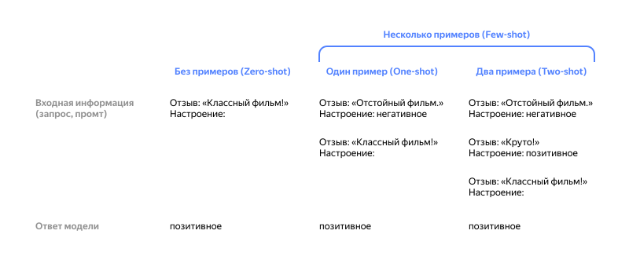
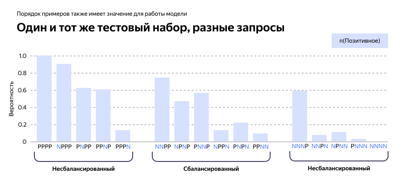

# Промтинг Few-Shot



Хотя крупные языковые модели демонстрируют отличные способности в режиме [Zero-shot](zero-shot.md), они все еще не справляются со сложными задачами. Промтинг Few-shot промтинг можно использовать как технику для обучения в контексте, где для повышения качества результатов модели предоставляются примеры, на которых она обучается.

Согласно [Touvron et al. 2023](https://arxiv.org/pdf/2302.13971.pdf), свойства Few-shot впервые появились, когда модели были масштабированы до достаточного размера [(Kaplan et al., 2020)](https://arxiv.org/abs/2001.08361).

Рассмотрим пример из работы [Brown et al. 2020](https://arxiv.org/abs/2005.14165), в котором задача заключается в правильном использовании нового слова в предложении:

**Промт**

```text
"Котопес" — это мифическое существо, которое является наполовину котом, наполовину собакой. Пример предложения, использующего слово "котопес":
Мы гуляли по лесу и увидели странного котопса.

"Фырчать" означает издавать короткие, резкие звуки. Пример предложения, использующего слово "фырчать":
```

**Ответ**

```text
Когда мы подошли ближе, котопес начал фырчать на нас.
```

Модель научилась выполнять задачу, хотя имела всего один пример (т.е. 1-shot). Для более сложных задач можно экспериментировать с увеличением количества примеров (например, 3-shot, 5-shot, 10-shot и т.д.).

Из работы [Min et al. (2022)](https://arxiv.org/abs/2202.12837) следует, что для составления промтов Few-shot важны даже случайные, неправильные примеры. 



Рассмотрим промт с неправильными примерами, в котором метки «Негативный» и «Позитивный» случайным образом присваиваются входным данным:

**Промт**
```text
Это потрясающе! // Негативный
Это плохо! // Позитивный
Вау, этот фильм был классный! // Позитивный
Какое ужасное шоу! //
```

**Ответ**
```text
Негативный
```

Мы все равно получаем верный ответ и формат, хотя метки были случайными. Также эксперименты подтверждают, что новые модели {{ yagpt-name }} становятся более устойчивыми к формату входных данных:

**Промт**
```text
Позитивный Это потрясающе! 
Это плохо! Негативный
Вау, этот фильм был классный!
Позитивный
Какое ужасное шоу! --
```

**Ответ**
```text
Негативный
```

Каждый пример из промта имеет разный формат, но модель все равно указала правильную метку. Однако, для сложных задач и разных вариаций промтов требуется более тщательный анализ.



При использовании промтов Few-shot в слишком сложных задачах модель может переобучиться. Это значит, что она случайным образом запомнит ответ на какой-либо вопрос и будет отвечать так в любых ситуациях.



## Ограничения промтов Few-shot {#few-shot-limits}

Стандартный промтинг Few-shot хорошо работает для многих задач, но все же не является идеальной техникой, особенно при работе со сложными задачами, требующими рассуждений. Рассмотрим пример из арифметики:

**Промт**

```text
Нечетные числа в этой группе складываются в четное число: 15, 32, 5, 13, 82, 7, 1. 

Ответ: 
```

**Ответ**

```
Да, нечетные числа в этой группе складываются в 107, что является четным числом.
```

Добавим несколько примеров, чтобы увидеть, улучшит ли результаты Few-shot-промт:

**Промт**

```text
Нечетные числа в этой группе складываются в четное число: 4, 8, 9, 15, 12, 2, 1.
Ответ: Ответ — Ложь.

Нечетные числа в этой группе складываются в четное число: 17, 10, 19, 4, 8, 12, 24.
Ответ: Ответ — Правда.

Нечетные числа в этой группе складываются в четное число: 16, 11, 14, 4, 8, 13, 24.
Ответ: Ответ — Правда.

Нечетные числа в этой группе складываются в четное число: 17, 9, 10, 12, 13, 4, 2.
Ответ: Ответ — Ложь.

Нечетные числа в этой группе складываются в четное число: 15, 32, 5, 13, 82, 7, 1. 
Ответ: 
```

**Ответ**

```text
Ответ — Правда.
```

Это неверный ответ. Кажется, что промта Few-shot недостаточно, чтобы получить надежный результат в задачах рассуждения. [Техника CoT](CoT.md) справляется с такими задачами лучше.

Если промтов Zero-shot и Few-shot недостаточно, возможно, модель не обладает достаточными знаниями для решения задачи. В этом случае рекомендуем попробовать [дообучить](../../tutorials/yagpt-tuning.md) модель или поэкспериментировать с другими техниками промтинга.

#### См. также {#see-also}

* [{#T}](CoT.md)
* [{#T}](self-consistency.md)
* [{#T}](../../tutorials/yagpt-tuning.md)
