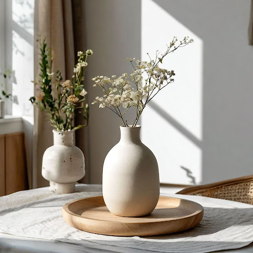

# Предметы декора

## Параметры запроса {#params}

* **Промт**: Минималистичная керамическая ваза на фоне светлого скандинавского интерьера, на столе.
* **Зерно**: `12`
* **Результат**:



## Структура запроса {#structure}

```json
{
  "modelUri": "art://<идентификатор_каталога>/yandex-art/latest",
  "generationOptions": {
    "seed": 12
  },
  "messages": [
    {
      "weight": 1,
      "text": "Минималистичная керамическая ваза на фоне светлого скандинавского интерьера, на столе"
    }
  ]
}
```





- cURL {#curl}

  



## Получение результата {#result}


