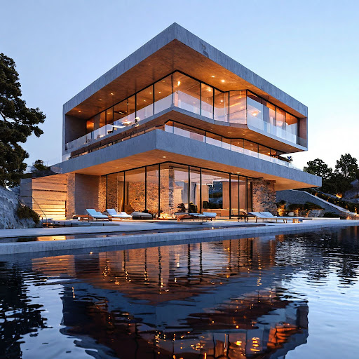

# Концепция экстерьера здания

## Параметры запроса {#params}

* **Промт**: Архитектура, дом в стиле Захи Хадид, игра света, высокая детализация, 3D рендер, houdini 3D, Octane 3D, водная гладь.
* **Зерно**: `5`
* **Результат**:



## Структура запроса {#structure}

```json
{
  "modelUri": "art://<идентификатор_каталога>/yandex-art/latest",
  "generationOptions": {
    "seed": 5
  },
  "messages": [
    {
      "text": "Архитектура, дом в стиле Захи Хадид, игра света, высокая детализация, 3D рендер, houdini 3D, Octane 3D, водная гладь"
    }
  ]
}
```





- cURL {#curl}

  



## Получение результата {#result}


