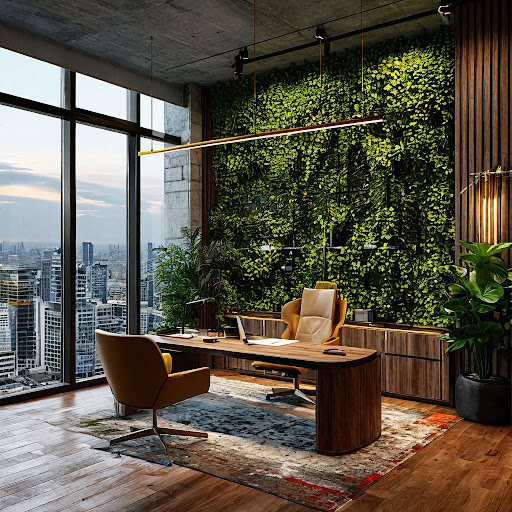

# Дизайн-проект офиса

## Параметры запроса {#params}

* **Промт**: Интерьер офисного кабинета, дизайн проект. Стена покрыта плющом, авангардные предметы интерьера, бетон, детали из латуни. Мягкий свет, полумрак, эстетика, вид из окна на панораму города.
* **Зерно**: `12`
* **Результат**:



## Структура запроса {#structure}

```json
{
  "modelUri": "art://<идентификатор_каталога>/yandex-art/latest",
  "generationOptions": {
    "seed": 12
  },
  "messages": [
    {
      "text": "Интерьер офисного кабинета, дизайн проект. Стена покрыта плющом, авангардные предметы интерьера, бетон, детали из латуни. Мягкий свет, полумрак, эстетика, вид из окна на панораму города"
    }
  ]
}
```





- cURL {#curl}

  



## Получение результата {#result}


