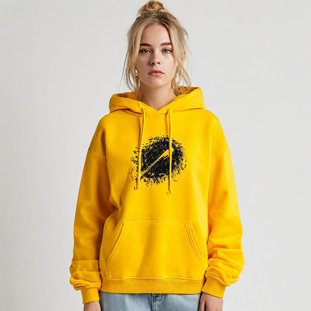

# Корпоративный мерч

## Параметры запроса {#params}

* **Промт**: Худи свободного кроя, жёлтого цвета, в центре иллюстрация с логотипом в виде рисунка кометы чёрного цвета. Минималистичная съемка товара, на светлом однотонном фоне, на модели со светлыми волосами.
* **Зерно**: `11`
* **Результат**:



## Структура запроса {#structure}

```json
{
  "modelUri": "art://<идентификатор_каталога>/yandex-art/latest",
  "generationOptions": {
    "seed": 11
  },
  "messages": [
    {
      "weight": 1,
      "text": "Худи свободного кроя, жёлтого цвета, в центре иллюстрация с логотипом в виде рисунка кометы чёрного цвета. Минималистичная съемка товара, на светлом однотонном фоне, на модели со светлыми волосами"
    }
  ]
}
```





- cURL {#curl}

  



## Получение результата {#result}


