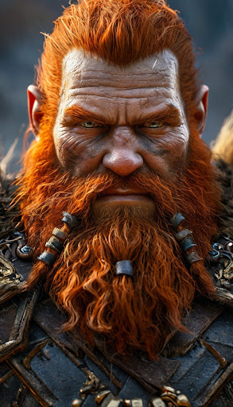

# Персонаж для игры

## Параметры запроса {#params}

* **Промт**: Гном, могучий воин, рыжая борода, ps5 graphics, портрет.
* **Зерно**: `10`
* **Пропорции**: `9:16`
* **Результат**:



## Структура запроса {#structure}

```json
{
  "modelUri": "art://<идентификатор_каталога>/yandex-art/latest",
  "generationOptions": {
    "seed": 10,
    "aspectRatio": {
      "widthRatio": "9",
      "heightRatio": "16"
    }
  },
  "messages": [
    {
      "text": "Гном, могучий воин, рыжая борода, ps5 graphics, портрет"
    }
  ]
}
```





- cURL {#curl}

  



## Получение результата {#result}


