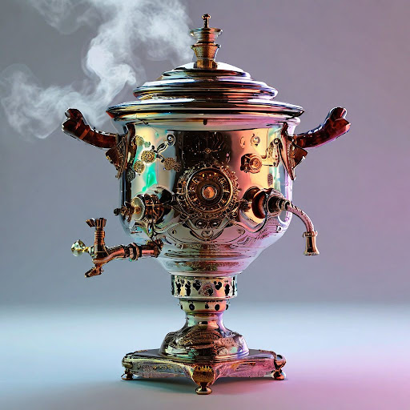

# Вымышленные предметы

## Параметры запроса {#params}

* **Промт**: Дизайн самовара в футуристичном стиле, стимпанк, неоновая подсветка, на однотонном светлом фоне, предметная съемка, пар от кипения.
* **Зерно**: `7`
* **Результат**:



## Структура запроса {#structure}

```json
{
  "modelUri": "art://<идентификатор_каталога>/yandex-art/latest",
  "generationOptions": {
    "seed": 7
  },
  "messages": [
    {
      "weight": 1,
      "text": "Дизайн самовара в футуристичном стиле, стимпанк, неоновая подсветка, на однотонном светлом фоне, предметная съемка, пар от кипения"
    }
  ]
}
```





- cURL {#curl}

  



## Получение результата {#result}


