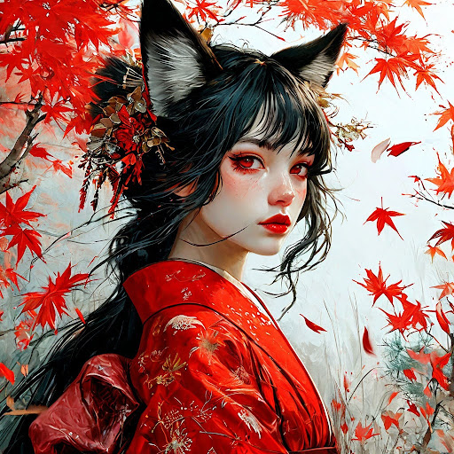

# Иллюстрация для книги

## Параметры запроса {#params}

* **Промт**: Девушка с черными волосами, бледная кожа, красные губы, лисьи уши, в традиционном красном кимоно, клены на заднем плане, белое небо, визионерский концепт-арт в стиле Альфонса Мухи и Rossdraws.
* **Зерно**: `10`
* **Результат**:



## Структура запроса {#structure}

```json
{
  "modelUri": "art://<идентификатор_каталога>/yandex-art/latest",
  "generationOptions": {
    "seed": 10
  },
  "messages": [
    {
      "text": "Девушка с черными волосами, бледная кожа, красные губы, лисьи уши, в традиционном красном кимоно, клены на заднем плане, белое небо, визионерский концепт-арт в стиле Альфонса Мухи и Rossdraws"
    }
  ]
}
```





- cURL {#curl}

  



## Получение результата {#result}


