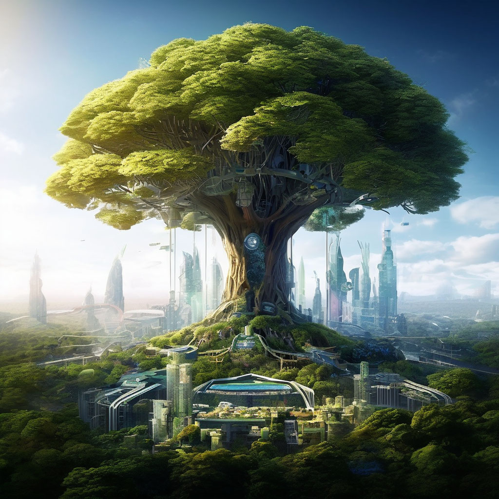

# Город будущего

## Параметры запроса {#params}

* **Промт**: Удивительный мир будущего, гармоничное сочетание технологий и природы, в центре композиции огромное дерево, внутри которого находится целый город.

* **Зерно**: `2`

* **Результат**:



## Структура запроса {#structure}

```json
{
  "modelUri": "art://<идентификатор_каталога>/yandex-art/latest",
  "generationOptions": {
    "seed": 2
  },
  "messages": [
    {
      "weight": 1,
      "text": "Удивительный мир будущего, гармоничное сочетание технологий и природы, в центре композиции огромное дерево, внутри которого находится целый город."
    }
  ]
}
```

Где `<идентификатор_каталога>` — [идентификатор каталога](../../../resource-manager/operations/folder/get-id.md) {{ yandex-cloud }}, у которого есть доступ к сервису {{ yagpt-name }}.



## Получение результата {#result}


