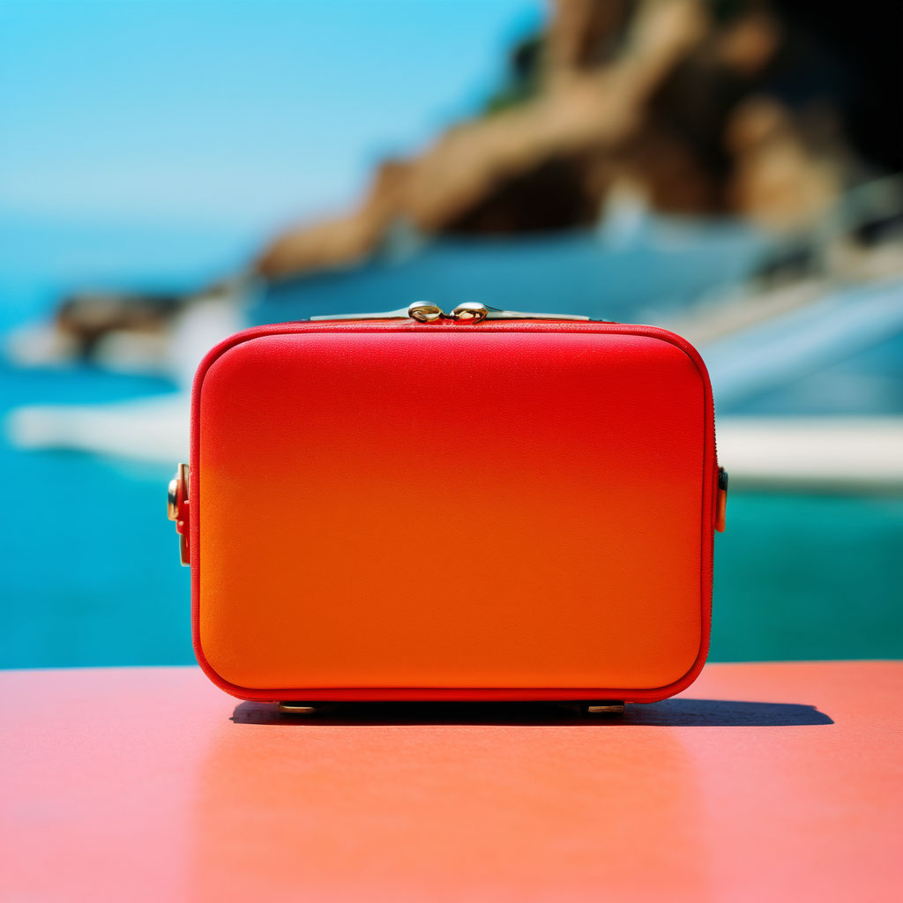

# Реклама сумки

## Параметры запроса {#params}

* **Промт**: Минималистичная фотография продукта, Луиджи Гирри, маленькая сумка крупным планом, в стиле lomo LC-A, светло-янтарный и красный, Габриэль Метсу, размытый фон, смелые линии, яркий цвет, вневременная элегантность, скульптура, Французская Ривьера.

* **Зерно**: `99`

* **Результат**:



## Структура запроса {#structure}

```json
{
  "modelUri": "art://<идентификатор_каталога>/yandex-art/latest",
  "generationOptions": {
    "seed": 99
  },
  "messages": [
    {
      "weight": 1,
      "text": "минималистичная фотография продукта, Луиджи Гирри, маленькая сумка крупным планом, в стиле lomo LC-A, светло-янтарный и красный, Габриэль Метсу, размытый фон, смелые линии, яркий цвет, вневременная элегантность, скульптура, Французская Ривьера"
    }
  ]
}
```





- cURL {#curl}

  



## Получение результата {#result}


