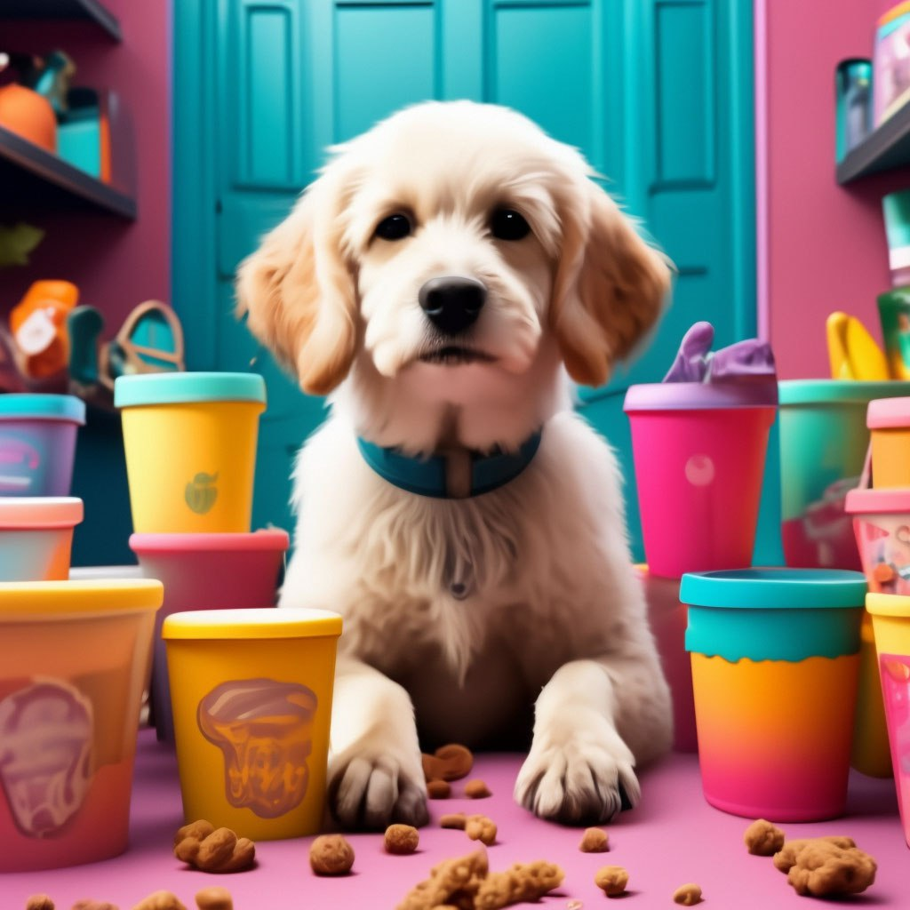

# Изображения для рекламы корма для собак

## Параметры запроса {#params}

* **Промт**: Корм для собак, сложные слои и текстуры, детализированный дизайн персонажей, фон с яркими, причудливыми и красочными сценами, пастельная цветокоррекция как в фильме Уэса Андерсона, зернистость пленки, Tokina at-x 11-16 мм f/2.8 Pro DX II

* **Зерно**: `737`

* **Результат**:



## Структура запроса {#structure}

```json
{
  "modelUri": "art://<идентификатор_каталога>/yandex-art/latest",
  "generationOptions": {
    "seed": 737
  },
  "messages": [
    {
      "weight": 1,
      "text": "корм для собак, сложные слои и текстуры, детализированный дизайн персонажей, фон с яркими, причудливыми и красочными сценами, пастельная цветокоррекция как в фильме Уэса Андерсона, зернистость пленки, tokina at-x 11-16 мм f/2.8 pro dx ii"
    }
  ]
}
```

Где `<идентификатор_каталога>` — [идентификатор каталога](../../../resource-manager/operations/folder/get-id.md) {{ yandex-cloud }}, у которого есть доступ к сервису {{ yagpt-name }}.



## Получение результата {#result}


