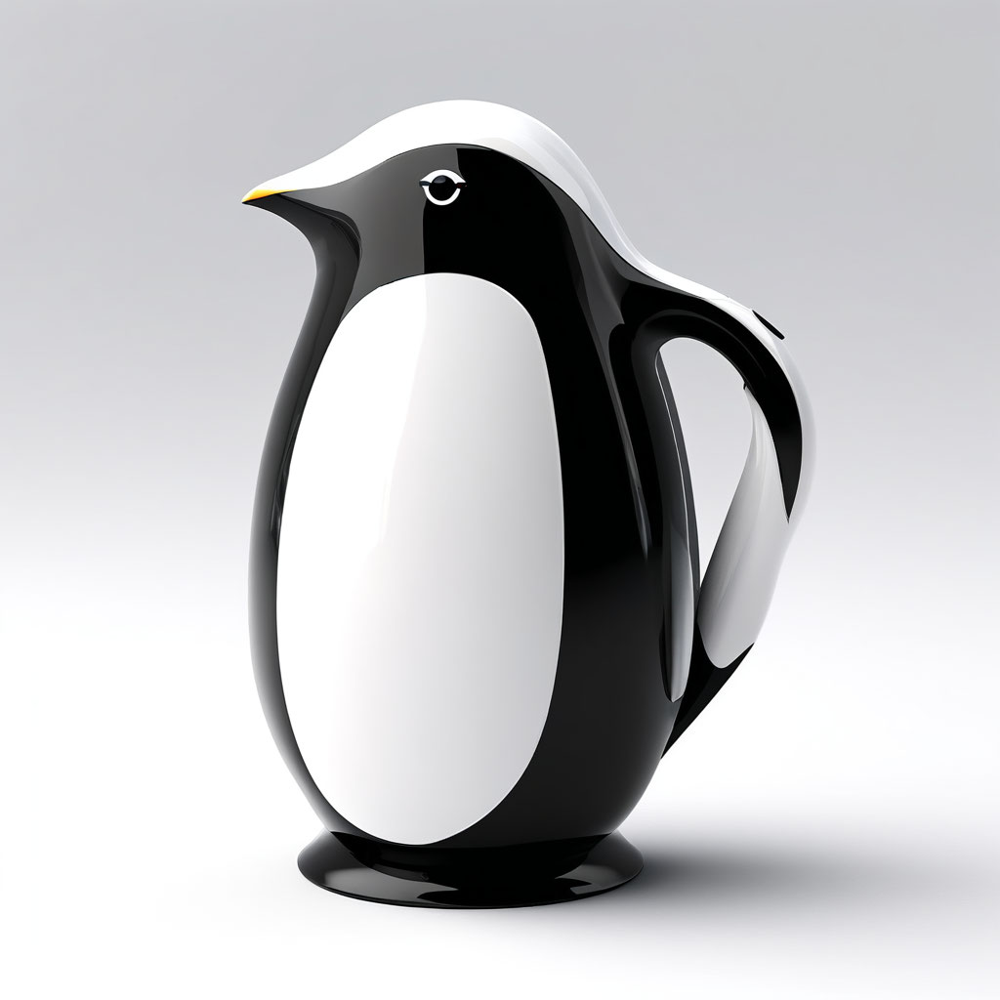

# Идеи дизайна чайника

## Параметры запроса {#params}

* **Промт**: Электрический чайник, в форме пингвина, в профиль, стилизация, белый фон, будущее, высокое качество, супер детализация.

* **Зерно**: `31`

* **Результат**:



## Структура запроса {#structure}

```json
{
  "modelUri": "art://<идентификатор_каталога>/yandex-art/latest",
  "generationOptions": {
    "seed": 31
  },
  "messages": [
    {
      "weight": 1,
      "text": "электрический чайник, в форме пингвина, в профиль, стилизация, белый фон, будущее, высокое качество, супер детализация"
    }
  ]
}
```





- cURL {#curl}

  



## Получение результата {#result}


