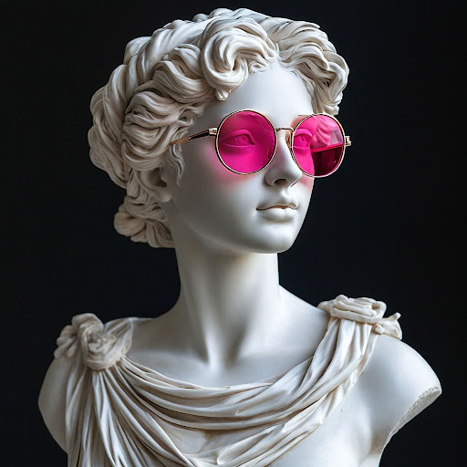

# Иллюстрация для материалов

## Параметры запроса {#params}

* **Промт**: Белая античная статуя, девушка, портрет, в современных очках авиаторах розового цвета, на чёрном фоне.
* **Зерно**: `2`
* **Результат**:



## Структура запроса {#structure}

```json
{
  "modelUri": "art://<идентификатор_каталога>/yandex-art/latest",
  "generationOptions": {
    "seed": 2
  },
  "messages": [
    {
      "text": "Белая античная статуя, девушка, портрет, в современных очках авиаторах розового цвета, на чёрном фоне"
    }
  ]
}
```





- cURL {#curl}

  



## Получение результата {#result}


