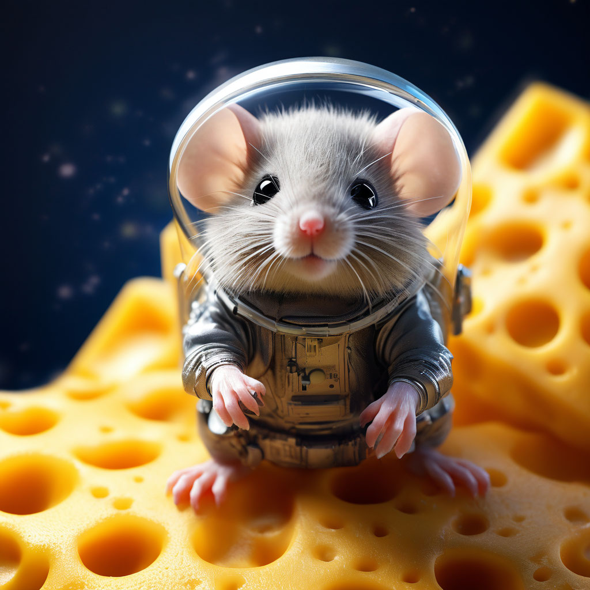

# Изображение мыши-путешественницы

## Параметры запроса {#params}

* **Промт**: Милый пушистый мышонок в скафандре, на планете, сделанной из сыра, сырные кратеры красиво, высокая детализация, свечение, высокое разрешение, бионическое животное, чёткая прорисовка пальцев, крупный план, глубина, гиперреализм, Octane render, f/2.8, ISO 200.

* **Зерно**: `218`

* **Результат**:



## Структура запроса {#structure}

```json
{
  "modelUri": "art://<идентификатор_каталога>/yandex-art/latest",
  "generationOptions": {
    "seed": 218
  },
  "messages": [
    {
      "weight": 1,
      "text": "милый пушистый мышонок в скафандре, на планете, сделанной из сыра, сырные кратеры красиво, высокая детализация, свечение, высокое разрешение, бионическое животное, чёткая прорисовка пальцев, крупный план, глубина, гиперреализм, Octane render, f/2.8, ISO 200"
    }
  ]
}
```





- cURL {#curl}

  



## Получение результата {#result}


