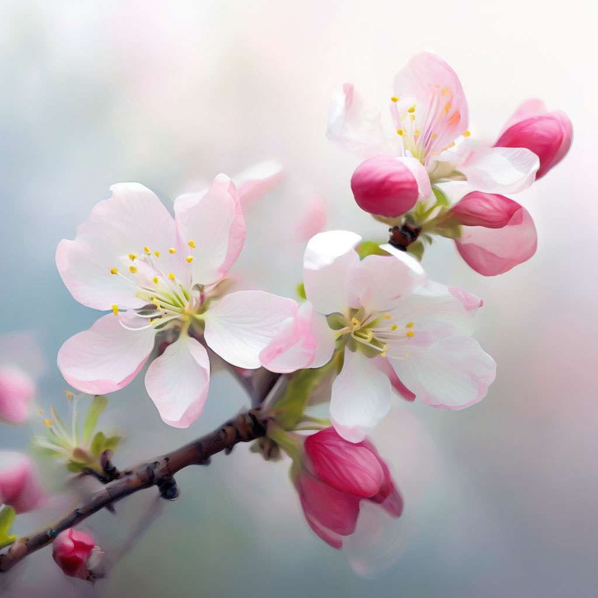

# Обложка для поста

## Параметры запроса {#params}

* **Промт**: Весеннее утро, нежное, абстрактное, размытое, эмоциональное, глазурь, градиент, несколько четких акцентных деталей, минимализм.

* **Зерно**: `1`

* **Результат**:



## Структура запроса {#structure}

```json
{
  "modelUri": "art://<идентификатор_каталога>/yandex-art/latest",
  "generationOptions": {
    "seed": 1
  },
  "messages": [
    {
      "weight": 1,
      "text": "Весеннее утро, нежное, абстрактное, размытое, эмоциональное, глазурь, градиент, несколько четких акцентных деталей, минимализм"
    }
  ]
}
```

Где `<идентификатор_каталога>` — [идентификатор каталога](../../../resource-manager/operations/folder/get-id.md) {{ yandex-cloud }}, у которого есть доступ к сервису {{ yagpt-name }}.



## Получение результата {#result}


