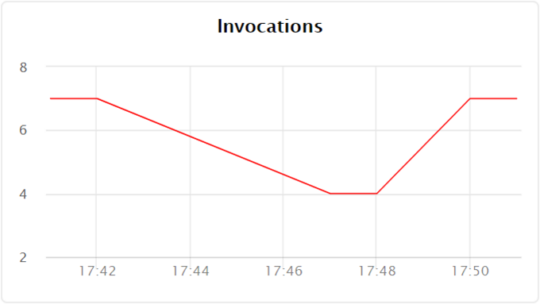
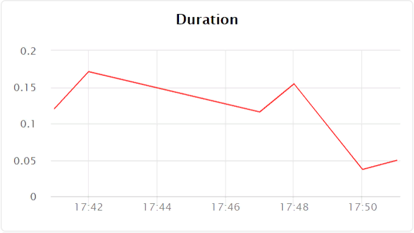
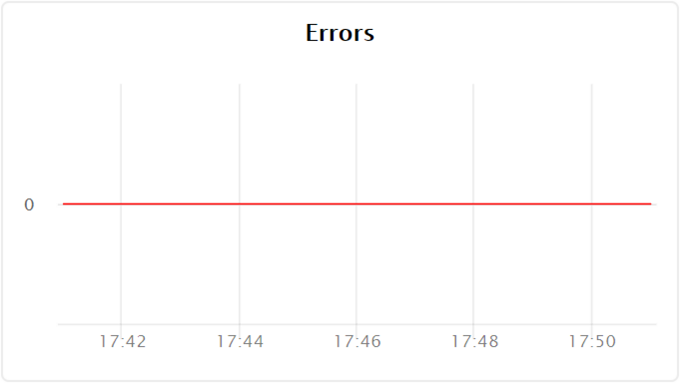

# Просмотр графиков мониторинга

Вы можете посмотреть график для следующих показателей:  
- [Количество вызовов функций](#invocations)
- [Среднее время выполнения функции](#durations)
- [Количество ошибок, возникших при выполнении функции](#errors)

## Количество вызовов функции {#invocations}

Чтобы посмотреть график:
1. Откройте раздел **{{ sf-name }}** в каталоге с функцией, информацию о которой вы хотите получить.
1. В списке функций выберите функцию, графики мониторинга которой вы хотите посмотреть.
1. На странице **Обзор** перейдите на вкладку **Мониторинг**.
1. Выберите период, за который необходимо отобразить информацию на графике. Вы можете выбрать заранее заданный интервал (час, день, неделя, месяц) или ввести произвольный период, изменив поля с датами.
1. Количество вызовов функции отображается на графике **Invocations**:
    
    
 
## Среднее время выполнения функции {#durations}

Чтобы посмотреть график:
1. Откройте раздел **{{ sf-name }}** в каталоге с функцией, информацию о которой вы хотите получить.
1. В списке функций выберите функцию, графики мониторинга которой вы хотите посмотреть.
1. На странице **Обзор** перейдите на вкладку **Мониторинг**.
1. Выберите период, за который необходимо отобразить информацию на графике. Вы можете выбрать заранее заданный интервал (час, день, неделя, месяц) или ввести произвольный период, изменив поля с датами.
1. Среднее время вызова отображается на графике **Durations**:
    
    
 
## Количество ошибок, возникших при выполнении функции {#errors}

Чтобы посмотреть график:
1. Откройте раздел **{{ sf-name }}** в каталоге с функцией, информацию о которой вы хотите получить.
1. В списке функций выберите функцию, графики мониторинга которой вы хотите посмотреть.
1. На странице **Обзор** перейдите на вкладку **Мониторинг**.
1. Выберите период, за который необходимо отобразить информацию на графике. Вы можете выбрать заранее заданный интервал (час, день, неделя, месяц) или ввести произвольный период, изменив поля с датами.
1. Количество ошибок, возникших при выполнении функции, отображается на графике **Errors**:
    
    

