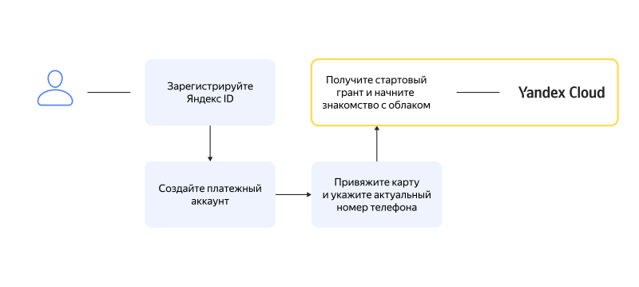

# Начало работы

Платформа {{ yandex-cloud }} имеет несколько пользовательских интерфейсов, например, [консоль управления]({{ link-console-main }}) и [интерфейс командной строки](../../cli/). Для доступа к любому пользовательскому интерфейсу вам потребуется _пользовательский аккаунт_. Это может быть личный аккаунт на Яндексе (Яндекс ID) или аккаунт в Яндекс.Коннект. Подробные инструкции смотрите в Справке [Яндекс ID](https://yandex.ru/support/passport/authorization/registration.html)(https://yandex.com/support/passport/authorization/registration.html) и [Яндекс.Коннекта](https://yandex.ru/support/connect/personal.html#personal__section_aq5_hcq_23b)(https://yandex.com/support/connect/personal.html#personal__section_aq5_hcq_23b).

## Создание платежного аккаунта {#new-account}

Платежный аккаунт необходим, даже если вы планируете пользоваться только бесплатными сервисами. После создания первого платежного аккаунта, привязанного к пользовательскому аккаунту, вам будет начислен стартовый грант. Подробнее о стартовом гранте читайте в разделе [{#T}](../../billing/concepts/bonus-account.md).

