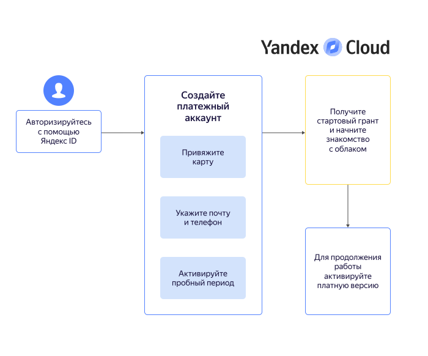

# Начало работы для физических лиц



## Создание платежного аккаунта {#new-account}

Платежный аккаунт необходим, даже если вы планируете пользоваться только бесплатными сервисами. При создании первого платежного аккаунта, привязанного к пользовательскому аккаунту, вам будет начислен [стартовый грант](../usage-grant.md).



   - Пробный период {#trial}

      

   - Платная версия {#paid}

      





Предоставьте данные для создания платежного аккаунта:

1. Укажите ваши имя, фамилию и отчество.

1. Привяжите карту: 

   
   
   
   
   

1. Укажите актуальные почту и телефон. Контактные данные нужны не только для связи с вами, но и для выставления счетов и финансовых документов.

1. Если это ваш первый платежный аккаунт в {{ yandex-cloud }}, вам доступно подключение [пробного периода](../free-trial/concepts/quickstart.md).

   

   В некоторых случаях при создании платежного аккаунта с пробным периодом может потребоваться дополнительная верификация. Сообщение с подробной инструкцией появится на странице этого платежного аккаунта в консоли управления.

   
   
   * Подключая пробный период, помните, что после его завершения ваши ресурсы будут приостановлены. Для возобновления работы потребуется перейти на [платную версию](../free-trial/concepts/upgrade-to-paid.md).
   * Если не подключать пробный период на данном этапе, ваш аккаунт будет создан с платным потреблением: после [использования стартового гранта](../usage-grant.md) вам не придется переходить на платную версию.

1. Нажмите кнопку **{{ ui-key.yacloud.common.create }}**.

