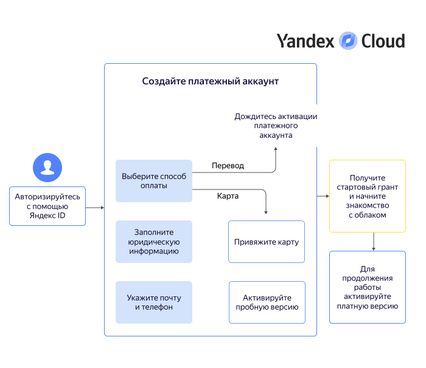

# Начало работы для юридических лиц



## Создание платежного аккаунта {#new-account}

Платежный аккаунт необходим, даже если вы планируете пользоваться только бесплатными сервисами. При создании первого платежного аккаунта, привязанного к пользовательскому аккаунту, вам будет начислен [стартовый грант](../usage-grant.md).

Предоставьте данные для создания платежного аккаунта.





