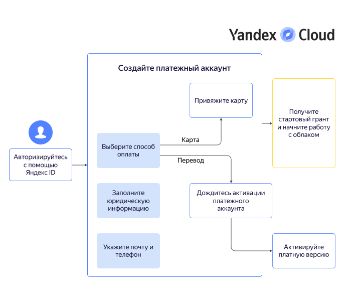

# Начало работы для юридических лиц



## Создание платежного аккаунта {#new-account}

Платежный аккаунт необходим, даже если вы планируете пользоваться только бесплатными сервисами. При создании первого платежного аккаунта, привязанного к пользовательскому аккаунту, вам будет начислен [стартовый грант](usage-grant.md).



   - Пробный период

      

   - Платная версия

      





Предоставьте данные для создания платежного аккаунта:
   
1. Выберите способ оплаты: **Банковская карта** или **Банковский перевод**. В любой момент после создания платежного аккаунта вы можете [изменить способ оплаты](../billing/operations/change-payment-method.md).



- Банковская карта

   1. Укажите юридическую информацию о вашей организации.

         

   1. Привяжите корпоративную банковскую карту:
   
      
   
      * Подтвердите, что карта является корпоративной и вы уполномочены ею распоряжаться.

      

      

   1. Укажите актуальные почту и телефон. Контактные данные нужны не только для связи с вами, но и для выставления счетов и финансовых документов.

   1. Если это ваш первый платежный аккаунт в {{ yandex-cloud }}, вам доступно подключение [пробного периода](free-trial/concepts/quickstart.md).

      

      В некоторых случаях при создании платежного аккаунта с пробным периодом может потребоваться дополнительная верификация. Сообщение с подробной инструкцией появится на странице этого платежного аккаунта в консоли управления.

      
   
      * Подключая пробный период, помните, что после его завершения ваши ресурсы будут приостановлены. Для возобновления работы потребуется перейти на [платную версию](free-trial/concepts/upgrade-to-paid.md).
      * Если не подключать пробный период на данном этапе, ваш аккаунт будет создан с платным потреблением: после [использования стартового гранта](usage-grant.md) вам не придется переходить на платную версию.

   1. Нажмите кнопку **Создать**.

- Банковский перевод

   1. Укажите юридическую информацию о вашей организации и ваши контактные данные.

      

   1. Нажмите кнопку **Создать**.

   Вы получите письмо с описанием дальнейших действий на почту, указанную в пользовательском аккаунте. Активация платежного аккаунта может занять до трех рабочих дней.

   Если это ваш первый платежный аккаунт в {{ yandex-cloud }}, он будет создан в пробном периоде. Чтобы продолжить пользоваться ресурсами после завершения пробного периода, не забудьте перейти на [платную версию](../billing/operations/activate-commercial.md). 













