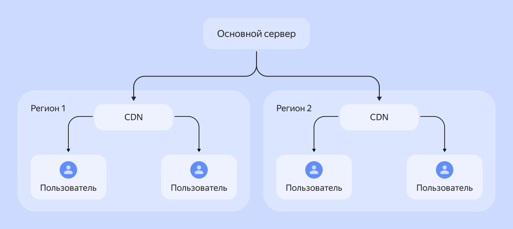
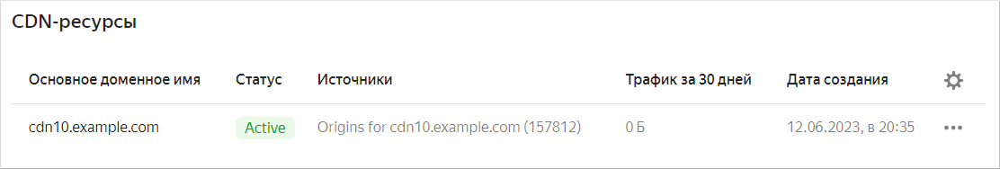

# Content Delivery Network (сеть распространения контента)

Сервис CDN (Content Delivery Network) представляет собой систему, которая в ответ на запросы от клиента запрашивает, получает, кеширует данные от источника и отдает их клиенту. Такой принцип значительно снижает нагрузку на источники хранения информации в интернете и ускоряет ее доставку пользователю.

## Принцип работы {#how-it-work}

Для того, чтобы сделать информацию доступной для большого количества людей, ее размещают в интернете на различных ресурсах. Обычно, пользователь, чтобы получить необходимую информацию, делает запрос в интернет. Поисковый сервис определяет источники, которые содержат требуемый контент и выдает результат в виде ссылок на источник. Наиболее востребованная информация выдается поисковыми системами большое число раз ежедневно.

Информация в источнике может находиться не только в виде статичных страниц, но и храниться в различных объектах, например базы данных, облачного хранилища или L7-балансировщика. Поэтому, сначала информацию обрабатывают, собирают в виде контента, который затем получает пользователь. Обработка данных занимает время и замедляет доставку их клиенту.

Применение сети доставки контента позволяет оптимизировать работу с веб-ресурсами:



- Без CDN
  
  Если работа веб-ресурса организована без использования CDN, запросы от пользователей направляются сразу на первичный сервер. С него же приходит ответ на браузер клиента. При большой частоте запросов нагрузка на источник и на сервисы обработки информации значительно возрастает. Если сервер расположен далеко от посетителя сайта, время на доставку еще больше увеличивается. В результате страницы загружаются медленно, возможны зависания.
  
- С CDN

  CDN-серверы позволяют снизить нагрузку на источник и ускорить доставку информации пользователю. Когда пользователь заходит на сайт, запрос направляется к ближайшему CDN-серверу. Если запрашиваемая информация кеширована на нем, данные сразу отдаются пользователю. Если данные запрашиваются впервые, или они устарели, CDN-сервер сначала загружает их с сервера-источника, а затем отдает клиенту.



### Основные компоненты {#main_components}

Исходные данные размещаются на _сервере-источнике_, которым может быть:

* Отдельный клиентский сервер.
* Сервер, выделенный хостинг-провайдером.
* Облачное хранилище. В архитектуру CDN может входить несколько таких серверов.

Информация с сервера-источника полностью или частично копируется в _точках присутствия_ или _пограничных узлах_. 

Пограничный узел — базовый компонент CDN. Здесь находятся копии или кешированные версии контента, полученного от основного источника. Их количество и географическое расположение влияет на эффективность использования CDN. Чем ближе они к пользователям интернет ресурса, тем быстрее доставляется им контент. Чем больше их количество, тем меньше нагрузка ни исходный сервер.

В CDN применяется два метода для определения самого близкого к пользователю пограничного узла:

* _GeoDNS_ — метод, который использует алгоритм определения геокоординат по IP-адресу пользователя. Запрос от клиента поступает на [DNS-сервер](./dns.md), где по IP-адресу определяется географическое расположение пользователя. После этого DNS-сервер находит точку присутствия, которая ближе других расположена к пользователю.
* _Anycast_ — этот метод, который использует в работе протокол BGP. В протоколе содержится информация о смежных сетях и их удаленности. В остальном Anycast работает подобно GeoDNS.

Также, в архитектуре CDN часто добавляют _экранирующие серверы_. Они работают в качестве обратного прокси и усиливают защиту основного сервера от критических нагрузок. Экранирующие серверы позволяют защитить основной сервер от пиковых увеличений трафика, создавая еще один защитный уровень.

### Преимущества использования {#use-advantage}

Основные преимущества использования CDN:

* CDN позволяет сократить время доставки содержимого сайта клиенту. Тем самым увеличивается скорость загрузки страниц, уменьшаются задержки в сети и зависания на сайтах. Пользователи реже уходят со страниц и дольше остаются на сайте.
* CDN позволяет сохранить доступность контента, если сервер-источник выходит из строя или оказывается заблокирован.
* Если какой-либо из серверов CDN отключится, в работу включится замена работающим сервером и обслуживание продолжится.
* Снижается нагрузка на сервер источника. 
* Снижаются требования к полосе пропускания.
* С помощью CDN можно предотвратить или значительно снизить последствия распределенных атак отказа в обслуживании (DDoS). Серверы CDN распределяют такие интенсивные всплески трафика между другими серверами-посредниками, чтобы уменьшить воздействие на реальный сервер.

## Выбор и настройка CDN {#select-settings}

### Факторы, влияющие на выбор CDN {#cdn-select}

При выборе подходящего провайдера CDN: 

* Оцените количество точек присутствия. Учитывайте географическое расположение CDN-серверов провайдера, насколько близки они к регионам с наибольшим количеством потенциальных пользователей ваших веб-ресурсов. 
* Учтите количество стыков с операторами связи. Этот факт оказывает большое влияние на скорость и устойчивость работы сети доставки контента.
* Узнайте, предоставляет ли провайдер возможность управления политиками кеширования, управления HTTP-заголовками, полную и выборочную очистку кеша и другие дополнительные сервисы.
* Проверьте поддержку провайдером технологий и протоколов, которые необходимы для функционирования вашей системы.

### Процесс настройки CDN на сайте {#settings}

Система CDN выполняет роль буфера между источником с первичной информацией и браузером клиента. Нужно внести правильные изменения на сайте, чтобы CDN-сервер смог получать информацию с сервера источника и отдавать ее клиенту:

* Зарегистрируйтесь на сайте выбранного сервиса, чтобы создать область загрузки.
* Создайте URL-адрес вашей CDN для перенаправления загрузки ваших файлов после настройки.
* Измените адреса файлов на вашем сайте, чтобы перенаправить их на CDN-сервер. Создайте переменную для CDN-адреса, и добавьте ее ко всем URL-адресам статических файлов вашего сайта. В дальнейшем, при необходимости, можно легко поменять адрес или отключить CDN, просто поменяв значение переменной.
* Настройте время кеширования для обновления контента с сервера и исходными данными.

## CDN и SEO {#cdn-seo}

SEO представляет собой комплекс мер по изменению веб-ресурса с целью повышения его рейтинга в результатах поиска по запросам пользователей. Чем более высокое место занимает сайт в выдаче поисковых систем, тем больше число его посетителей.

### Влияние CDN на рейтинг сайта в поисковых системах {#rating}

Крупные интернет-ресурсы посещает большое количество пользователей. Увеличивается нагрузка на сервер и каналы связи. Низкая скорость загрузки страниц затрудняет просмотр контента и использование сайта. Это, в свою очередь, увеличивает показатель отказов, что приводит к снижению рейтинга в поисковой выдаче.

Большое количество CDN-серверов, их близкое расположение к конечному пользователю снижает нагрузку на исходный сервер и обеспечивает быструю доставку контента. Быстрая загрузка значительно повышает рейтинг сайта в поисковых системах, перемещая его на первые строчки поисковой выдачи. Пользователи чаще и дольше остаются на таких веб-ресурсах, реже уходят с них, что, в конечном итоге, повышает конверсию.

### Оптимизация SEO с использованием CDN {#seo-optinization}

При использовании CDN следует учитывать влияние на SEO.

На пограничных узлах фактически дублируется информация с основного сервера. Поисковые системы негативно оценивают повторение контента и снижают рейтинг ресурса в выдаче. Можно указать поисковым системам, что информация является версией контента с основного источника. Для этого используют канонические ссылки.

Алгоритмы кеширования CDN помогают оптимизировать отдачу динамического контента за счет кеширования статических страниц (например, домашняя страница, страницы описания товара). Сброс кеша позволяет мгновенно актуализировать информацию в пограничном сервере.

Предзагрузка файлов с источника ускорит загрузку содержимого уже при первом запросе.

Сжатие текстовой информации является базовой возможностью CDN повысить скорость загрузки страниц и улучшить показатели SEO.

CDN автоматически оптимизирует изображения за счет сжатия и форматирования, уменьшая размер графического содержимого без ухудшения качества. Снижается нагрузка на сервер, увеличивается скорость доставки контента конечному пользователю.

### Примеры оптимального взаимодействия CDN и SEO {#best-practices}

CDN демонстрирует все свои преимущества в случаях, когда к контенту быстро происходит много запросов. Например, после выхода обновления онлайн‑игры. В такой ситуации сеть доставки контента снимает нагрузку с источника контента, перенаправляя запросы на свои кеширующие серверы. Подробнее см. в [блоге](https://yandex.cloud/ru/blog/posts/2022/08/cdn-and-gamedev).

Сайт онлайн-кинотеатра содержит много изображений и видео в высоком разрешении. Готовится показ долгожданной премьеры. Ожидается большая пиковая посещаемость веб-ресурса и увеличение нагрузки на сервер более, чем в десять раз. В случае использования CDN, с применением предварительной загрузки контента в точках присутствия, нагрузка будет относительно равномерно распределена между промежуточными CDN-серверами. Это позволит избежать падения сервера-источника и проблем с пропускной способностью канала связи. Большинство пользователей не испытает трудностей с просмотром фильма. Аудитория кинотеатра останется довольной.

## CDN сервис в {{ yandex-cloud }} {#cdn-yc}

{{ cdn-full-name }} позволяет развернуть сеть доставки контента, чтобы распределить часть нагрузки на CDN-серверы за счет кеширования и значительно ускорить получение контента конечными пользователями.

### Как развернуть в {{ yandex-cloud }} {#deploy-in-yc}

Перед началом работы с сетью доставки контента убедитесь, что у вас есть доменное имя и доступ к настройкам DNS на сайте компании, которая предоставляет вам услуги DNS-хостинга. Далее выполните первоначальные настройки {{ yandex-cloud }}. Активируйте провайдер CDN, создайте CDN-ресурс и настройте `CNAME` для своего домена.

Разместите контент в источниках: ваш сервер с доменным именем, [бакет Object Storage](../storage/concepts/bucket.md) или [L7-балансировщик Application Load Balancer](../application-load-balancer/concepts/application-load-balancer.md).

В {{ cdn-full-name }} создайте [ресурс](../cdn/concepts/resource.md), в котором указываются: источники, доменные имена для раздачи контента и другие настройки CDN.

После настройки при запросе файла по доменному имени, указанному в настройках, CDN обеспечивает оптимальную доставку информации клиенту.

Подробнее смотрите в [документации](../cdn/quickstart.md).

### Заключение {#finale}

Ускоряя загрузку страниц, повышая доступность информации, CDN повышает конверсию и улучшает рейтинг вашего ресурса в поисковиках.

* Важно правильно [выбрать](#cdn-select) CDN-провайдера для вашего сайта.
* Правильная настройка также важна, чтобы использование CDN принесло максимальный эффект. 

#### См. также

* [Обзор сервиса {{ cdn-full-name }}](../cdn/concepts/index.md)
* [Документация {{ cdn-full-name }}](../cdn/index.yaml)
* [Зачем игровой индустрии сервис CDN](https://yandex.cloud/ru/blog/posts/2022/08/cdn-and-gamedev)
* [СDN и новые возможности объектного хранилища](https://www.youtube.com/watch?v=yJvJruCG7TM)
