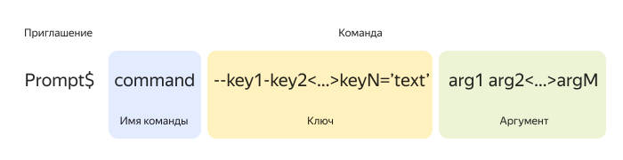

# Обзор CLI: все о командной строке и ее возможностях

CLI (Command Line Interface) — интерфейс командной строки, позволяющий управлять различными процессами в компьютере с помощью текстовых команд. При этом необходимо следовать специальному синтаксису таких команд. CLI существует во всех операционных системах. Также собственный CLI есть в облачных сервисах и некоторых пакетах приложений.

С помощью CLI можно:
  * Переименовывать, перемещать, удалять, преобразовывать файлы и каталоги.
  * Открывать и закрывать программы.
  * Управлять различными процессами на компьютере.
  * Управлять приложениями облачных сервисов.
  * Управлять правами доступа к ресурсам.
  * Оптимизировать выполнение повторяющихся задач.

## Сравнение CLI И GUI {#comparison-cli-gui}

До 1968 года, пока не изобрели компьютерную мышь, единственным устройством ввода была клавиатура. Экран компьютера того времени отображал только текстовую информацию, а CLI был стандартным пользовательским интерфейсом. Единственным способом управления компьютером был ввод текстовых команд.

С появлением мыши стало возможно по-новому взаимодействовать с компьютером — наводить курсор. Операционные системы стали использовать GUI — графический пользовательский интерфейс. Так пользователь видит объекты на экране и может выполнять с ними какие-либо действия с помощью мыши, а компьютер реагирует на это, выполняя соответствующие задачи. Человек понимает такой способ интуитивно, поэтому чаще всего им и пользуются. 

### Недостатки CLI {#disadvantages-cli}

  * CLI имеет ограниченные возможности для представления информации.

    [Экспериментально доказано](https://affect.media.mit.edu/pdfs/05.larson-picard.pdf), что эстетика и типографика текста влияет на восприятие информации. «Красивый» текст усваивается лучше. В CLI основная функция текста — информативность, но не красота. В GUI, напротив, информацию можно представить не только в виде текста, но и графиков, схем, диаграмм и т.д. Это позволяет легче воспринимать информацию и в некоторых случаях получать более «наглядную» картину происходящих процессов.

  * CLI кажется более сложным, чем GUI. 

    Для широкого круга пользователей GUI — привычный формат работы с компьютером. Освоение GUI чаще всего происходит интуитивно, в то время как использование CLI требует специального изучения. Однако, стоит отметить, что изучение основ CLI на самом деле не такое сложное, как кажется. Команды в CLI простые и логичные. Вы всегда видите, что происходит после того, как запустили команду. Более подробно об основах CLI читайте в разделе [Основные понятия CLI](#basic-concepts-cli).

### Преимущества CLI {#advantages-cli}

Однако, несмотря на популярность GUI, CLI все еще активно используют, поскольку он имеет ряд преимуществ:

  * Направленность внимания.

    Интерфейс CLI отображает информацию только по тому проекту, над которым в настоящий момент идет работа. Это позволяет меньше отвлекаться, глубоко погружаясь в процесс. При необходимости вы можете переключиться на другой процесс, используя определенное сочетание клавиш. Работа без использования мыши позволяет существенно увеличить скорость.

  * Информативность.

    CLI всегда содержит более широкий набор команд, чем GUI. Прежде чем те или иные возможности реализуются в графическом интерфейсе, они всегда сначала существуют в CLI. Кроме того, некоторые из команд имеют только текстовый формат без соответствующих аналогов в графическом интерфейсе. Все это позволяет CLI получать значительно более широкие возможности в управлении компьютером.

  * Компактность.

    CLI занимает гораздо меньше места на компьютере, чем любой графический интерфейс. Это позволяет выполнять аналогичные задачи с меньшими затратами ресурсов.

  * Автоматизация.

    Выполнение повторяющихся задач в GUI занимает большое количество времени и ресурсов. С помощью CLI можно автоматизировать такие процессы, написав список команд, которые должен выполнять ваш компьютер. 

## Основные понятия CLI {#basic-concepts-cli}

Давайте разберемся с основными терминами CLI.

### Оболочка {#shell}

Оболочка — это пользовательский интерфейс, отвечающий за обработку команд, введенных в CLI. Оболочка является посредником между пользователем и операционной системой. CLI по умолчанию реализован в различных оболочках в зависимости от того, какая операционная система установлена на компьютере. 

**Стандартные оболочки CLI по типу ОС**

|Windows      |Командная строка (Command Prompt)|
| ----------- | -----------                     |
|Linux        |Linux Bash Shell                 |
|MacOS        |Mac Terminal                     |

Кроме встроенных оболочек существуют так же те, которые пользователь может установить к себе на компьютер при необходимости. Например, для управления облачными сервисами или пакетами программ.

Стоит отметить, что некоторые из оболочек CLI являются кроссплатформенными и поддерживаются сразу несколькими системами. Например, PowerShell поддерживается операционными системами Windows, Linux, macOS, а также может использоваться для управления облачным сервисом Google Cloud.

### Командная строка {#command-line}



Под термином _Командная строка_ здесь подразумевается текстовая строка для выполнения команд в **любой** оболочке CLI, а не приложение «Командная строка (Command Prompt)» — стандартная оболочка CLI в ОС Windows.



Командная срока в CLI имеет определенный синтаксис, включающий в себя несколько элементов:

<center>



</center>

#### Приглашение {#promt}

_Приглашение_ — обязательный элемент командной строки, располагающийся в самом начале. Приглашение оканчивается специальным символом. В Windows, например, это — «>», в других операционных системах — «$» или «%». Такой символ сигнализирует о том, что CLI готов к вводу команды. Приглашение появляется при открытии командной строки и после завершения очередной команды.

#### Команда {#command}

_Команда_ — это выраженное в текстовом виде предписание для компьютера. После введения команды нужно нажать клавишу **Enter**, чтобы компьютер ее выполнил. Команды, которые используются наиболее часто, представлены в разделе [Основные команды и функции CLI](#basic-commands).

Команда состоит из нескольких частей:

  1. _Имя команды_ — обязательный элемент, располагающийся в самом начале команды и сразу после приглашения. Имя команды обозначает действие, которое вы хотите выполнить, представленное в виде текста. Существует множество команд, решающих различные задачи.

  1. _Ключ_ — это необязательный элемент команды, который располагается после названия и начинается с дефиса «-» или двойного дефиса «--». Ключ обозначает вспомогательные параметры, которые вы применяете к команде. Сам по себе, без команды, ключ смысла не имеет. Один и тот же ключ применительно к разным командам может иметь разное значение. К одной команде можно применить несколько ключей одновременно.

  1. _Аргумент_ — это необязательный элемент команды, который располагается в конце. Аргумент обозначает различные входные данные, необходимые для выполнения команды. Например, аргументом может быть название файла, который вы хотите удалить. К одной команде можно применить несколько аргументов одновременно.

## Основные команды и функции CLI {#basic-commands}

Возможности оболочек CLI могут существенно отличаться и зависят от того, какие команды доступны для работы. В качестве примера в этом разделе представлена кроссплатформенная оболочка PowerShell. Если на вашем компьютере нет оболочки PowerShell, [скачайте и установите](https://learn.microsoft.com/ru-ru/powershell/scripting/install/installing-powershell?view=powershell-7.3) ее.

### Команды в PowerShell {#powershell-command}

В PowerShell более 200 различных команд. Они позволяют охватить все доступные для PowerShell функции: от работы с файлами и каталогами до встраивания исполняемых компонентов в сторонние программы. При этом чаще всего в работе используется лишь несколько десятков основных команд.

Попробуйте CLI, выполнив последовательно несколько простых команд в PowerShell:

  1. `get-location` — отобразите имя текущей директории.
  1. `get-childitem` — отобразите содержимое директории.
  1. `mkdir testdir` — создайте в этой директории новую папку с именем «testdir».
  1. `set-location testdir` — перейдите в папку «testdir». 
  1. `new-item -name "testfile.txt" -itemtype "file" -value "I created this text using the CLI!"` — создайте в этой папке файл «testfile.txt», содержащий текст «I created this text using the CLI!»
  1. `copy-item testfile.txt testfile-copy.txt` — сделайте копию этого файла. 
  1. `get-content testfile-copy.txt` — отобразите содержимое скопированного файла. Если ответ «I created this text using the CLI!», вы все сделали верно.

Эти команды показывают лишь малую часть возможностей CLI. Но они также показывают, что начать работать в CLI совсем несложно. 

### Продвинутые возможности и советы {#advanced-features}

Давайте погрузимся в CLI немного глубже.

#### Как изучать новые команды {#new-command}

Чтобы увидеть список всех доступных команд в PowerShell, выполните команду `get-command`.

Чтобы узнать информацию о какой-либо команде, выполните команду `get-help <имя_команды>`. По умолчанию отображается краткая справка, но вы можете использовать следующие ключи:
  * `-detailed` — для более детальной справки.
  * `-examples` — для отображения примеров использования команды.
  * `-full` — для полной справки.
  * `-online` — для перехода на веб-страницу со справкой.

Например, команда `get-help -full new-item` предоставит полную информацию о команде `new-item`.

#### Алиасы {#aliases}

Самые популярные команды в PowerShell имеют _алиасы_ — короткие псевдонимы. Например, команде `get-process` соответствует алиас `gps`, а `get-content` — `gc`. Чтобы увидеть все доступные алиасы, выполните команду `get-alias`.

Используйте алиасы, чтобы упростить и ускорить работу в CLI.

#### Фоновое выполнение задач {#background-task}

Задачи можно запускать в фоновом режиме, используя команду `start-job`. Это позволит запускать следующие задачи, не дожидаясь окончания текущей. Вы можете запустить в фоновом режиме одновременно любое количество задач.

Например, чтобы запустить `get-service` в фоновом режиме, выполните команду `start-job {get-service}`.

Также для работы с фоновыми задачами используйте следующие команды:

  * `get-job` — показывает список фоновых задач.
  * `receive-job` — показывает результат фоновой задачи.
  * `remove-job` — удаляет фоновую задачу.
  * `stop-job` — останавливает фоновую задачу.
  * `wait-job` — отменяет фоновый режим для задачи.

#### Конвейер {#pipeline}

Вы можете передать результат одной команды на вход другой. Такой принцип работы называется конвейером, он позволяет упростить решение сложных задач. Количество команд в конвейере не ограничено. Чтобы использовать принцип конвейера, используйте знак «|» между командами.

Например:

```
get-service | sort-object -property status
```

#### Советы для оптимизации работы с CLI

  * Чтобы избежать опечаток и ускорить работу, используйте клавишу **tab**. Введите несколько первых букв имени команды и нажмите **tab**. Интерфейс автоматически завершит имя. Также используйте **tab** для завершения аргументов (имя файла или каталога). 
  * Чтобы отменить запущенную команду, нажмите **CTRL + C**. Обратите внимание, что при этом в PowerShell не должно быть выделенного курсором текста.
  * Чтобы повторно ввести команду, используйте **стрелки вверх и вниз** на клавиатуре. Они позволяют прокручивать историю ранее введенных команд.
  * Чтобы разбить слишком длинную команду на несколько строк, поставьте в месте переноса гравис **«`»**.
  * Чтобы создать новую строку, нажмите **Shift + Enter** (строка появится ниже текущей) или **Ctrl + Enter** (строка появится выше текущей).
  * Чтобы написать в одной строке несколько команд, разделите их знаком **«;»**.
  * В PowerShell регистр не важен, поэтому вы можете записывать команды любым сочетанием строчных и заглавных букв. 

## CLI в {{ yandex-cloud }} {#links}

Несмотря на популярность графического интерфейса, операционные системы до сих пор предлагают встроенные CLI. И это понятно, ведь CLI дает возможность более глубокого управления процессами в компьютере. Умение ориентироваться в CLI — важный навык, который полезен не только экспертам, но и обычным пользователям.

В [{{ yandex-cloud }}](https://yandex.cloud/ru) реализована возможность управления продуктами при помощи собственной оболочки CLI — [CLI Yandex Cloud](../cli/quickstart.md). Воспользуйтесь [пошаговой инструкцией](../cli/operations/install-cli.md), чтобы установить CLI Yandex Cloud к себе на компьютер.
