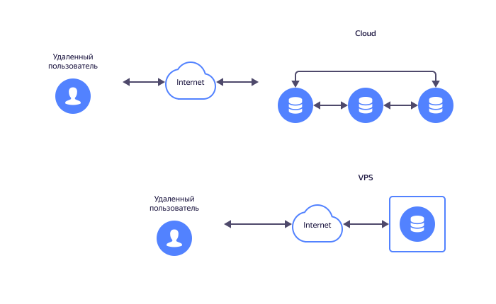

# Облачный сервер

Облачный сервер — это удаленный сервер или совокупность серверов, ресурсы которых предоставляются пользователям через интернет. Пользователь сам определяет требуемый набор вычислительных мощностей, а затем оплачивает их аренду. В любой момент этот набор можно расширить или сократить без простоев и перебоев в работе.

## Что такое облачный сервер

В основе принципов построения и использования облачных серверов лежат понятия облака и облачных услуг.

### Облака и их виды

Облако — это сеть мощных компьютеров, расположенных в дата-центрах и доступных через интернет. Существует три основных вида облака: частное, публичное и гибридное.

|  |  |
| ------------- | ------------------------------------------- |
| **Частное** | Все оборудование располагается в собственных помещениях компании, а его обслуживанием занимаются внутренние сотрудники. Информация и инфраструктура надежно защищены, но для этого требуются большие финансовые вложения. |
| **Публичное** | Компания арендует оборудование в необходимом ей объеме, а техническим обслуживанием занимается поставщик услуг. Это позволяет устранить затраты на поддержание вычислительной инфраструктуры и дает гибкость при выборе ресурсов. |
|**Гибридное** | Часть оборудования принадлежит компании и установлено на ее стороне, а часть она арендует. Такой подход встречается при постепенной миграции в облако, а также в случаях, когда требуется хранить высокочувствительные данные и компания не может доверить это стороннему исполнителю. |

### Модели облачных услуг

Облачные услуги в основном предоставляются по трем моделям: программное обеспечение как услуга (_SaaS_, _Software-as-a-Service_), платформа как услуга (_PaaS_, _Platform-as-a-Service_) и инфраструктура как услуга ([_IaaS_](../../blog/posts/2022/01/iaas), _Infrastructure-as-a-Service_).

* **Программное обеспечение как услуга** — программные решения, не требующие установки на стороне пользователя. Программа размещается на серверах поставщика, а клиент получает к ней доступ через браузер или предустановленную интерфейсную оболочку. Примером таких решений служат различные почтовые службы, системы резервирования, виртуальные рабочие столы.
* **Платформа как услуга** — готовые комплексные решения под определенные задачи. Пользователь использует аппаратные и программные ресурсы поставщика, настроенные специально для выполнения конкретных действий. Это могут быть системы машинного обучения и управления базами данных или среды разработки и тестирования приложений.
* **Инфраструктура как услуга** — набор вычислительных ресурсов, сетей, хранилищ данных. Пользователь арендует виртуальные машины с необходимой конфигурацией и использует их так, словно они физически расположены на его стороне.

Существуют и менее известные модели: диск как услуга (_DaaS_, _Disk-as-a-Service_), бизнес-процесс как услуга (_BPaaS_, _Business-Process-as-a-Service_), резервирование данных как услуга (_BaaS_, _Backup-as-a-Service_) и другие. При этом концепция облачных серверов обычно ассоциируется с моделью IaaS.

### Облачный сервер как услуга

В рамках модели IaaS поставщик услуг [виртуализирует](virtualization.md) физические ресурсы своих дата-центров, а затем распределяет их среди потребителей. При заключении договора аренды клиент получает доступ к своему серверу с индивидуальным набором характеристик, отвечающим заданным требованиям.

Облачный и виртуальный сервера — это разные понятия. Каждый из них представляет собой доступную через интернет виртуальную среду. Однако облачный сервер построен на множестве объединенных в сеть физических серверов — и в любой момент вы можете масштабировать доступные ресурсы без перерыва в работе. А виртуальные серверы являются частью одного физического сервера, чьи ресурсы распределяются равномерно между всеми клиентами и не предполагают оперативного перераспределения. Следовательно, виртуальные серверы — это технологические предшественники облачных.

### Зачем нужен облачный сервер

Такой сервер выполняет все те же функции, что и мощный физический компьютер: хранение и обработка данных, сложные вычисления, хостинг готовых приложений, развертывание рабочих сред, тестирование продуктов, решение специфических задач организации.

Но очевидно, что по сравнению с физическим оборудованием у облачного сервера есть множество неоспоримых преимуществ:

* **Быстрый запуск** — клиент получает необходимые ресурсы буквально за минуты, просто выбирая и подключая нужные параметры на сайте поставщика услуг.
* **Индивидуальный подход** — при подключении ресурсов для аренды клиент имеет возможность выбрать параметры сервера и сетевых компонентов, которые точно соответствуют его задачам.
* **Экономичность** — арендовать виртуальные серверы со всем спектром услуг априори дешевле, чем покупать сложное мощное оборудование, которое предполагает постоянные затраты на поддержку и обслуживание.
* **Эффективность и масштабируемость** — нет необходимости иметь оборудование «про запас» с учетом предполагаемого будущего развития бизнеса. Если вдруг требования к вычислительным ресурсам изменятся, их набор можно расширить или сократить всего за несколько кликов — и без перерыва в работе.
* **Надежность** — облачные серверы всегда реплицируются и резервируются, то есть данные копируются и хранятся сразу на нескольких физических машинах.
* **Безопасность данных** — ответственные провайдеры обладают всеми сертификатами, аттестатами и лицензиями, необходимыми для работы с любой чувствительной информацией — персональными данными, конфиденциальными корпоративными сведениями, секретными научными разработками и т. д.
* **Мобильность** — сотрудники компании — потребители услуг могут подключаться к рабочим серверам из любых географических локаций и с помощью любых разрешенных в организации устройств.
* **Постоянные улучшения** — ответственный провайдер всегда следит за технологическими трендами в сфере предоставления услуг и вовремя внедряет новые разработки, благодаря чему возможности клиентов постоянно совершенствуются.

Благодаря этим всем преимуществам облачный сервер становится для своего пользователя мощным, надежным и недорогим компьютером с практически бесконечным набором возможностей.

### Как выбрать провайдера облачных услуг

При выборе провайдера нужно учитывать следующие аспекты:

* Репутация и опыт — чем дольше провайдер представлен на рынке, тем проще доверять ему.
* Наличие пробного периода — надежные провайдеры обычно предоставляют новым клиентам возможность протестировать свои сервисы.
* Соответствие требованиям законодательства в сфере защиты данных — ответственные провайдеры обладают всеми необходимыми сертификатами, аттестатами и лицензиями.
* Спектр услуг и качество техподдержки — провайдер должен предоставлять все необходимые клиенту возможности, а также оперативную и грамотную техническую поддержку.
* Географическое расположение дата-центров и возможность экскурсии по ним — от удаленности серверов зависит скорость работы вашей системы, а их открытость к посещению отражает уверенность поставщика в качестве и надежности его оборудования.

### {{ compute-full-name }}

Сервис [{{ compute-full-name }}](../../services/compute) предоставляет доступ к масштабируемым вычислительным мощностям, на базе которых создаются единичные виртуальные машины или их отказоустойчивые группы. К этим машинам можно подключать диски, которые автоматически реплицируются для сохранности данных. Функция съемки дисков позволяет быстро переносить данные с одного диска на другой. [Широкий выбор других сервисов](../../services#_all) позволяет формировать различные комбинации услуг, чтобы подобрать решение специально под ваши задачи.

{{ yandex-cloud }} работает по модели Success Fee. Это значит, что каждый новый клиент получает возможность оценить работу сервиса в течение бесплатного пробного периода. Только после этого заключается контракт — причем все условия фиксируются еще до начала пилотного проекта.

Платформа предоставляет подробные инструкции и документацию по каждому сервису, а также услуги специалистов по адаптации в облаке.

[Обсудите пилотный проект](../../for-business#contact-form) с нашим специалистом, чтобы получить представление обо всех условиях партнерства.

### Полезные материалы

* [Документация {{ compute-full-name }}](../compute/)
* [Блог](../../blog)
* Истории успеха:
    * [Как обрабатывать 160+ кандидатов в минуту: кейс HR Messenger и {{ yandex-cloud }}](../../cases/hrmessenger)
    * [Личные данные для корпоративного пользования: ЕАЕ-Консалт провел миграцию системы SAP HCM в {{ yandex-cloud }}](https://cloud.yandex.ru/cases/eae-consult)
* Видео по теме:
    * [Настройка {{ yandex-cloud }} — виртуальная машина с пробным периодом](https://www.youtube.com/watch?v=9bIyY_UYg94)
    * [{{ compute-name }}: автоматизированный рендеринг в облаке. Опыт ТурбоРендер](https://www.youtube.com/watch?v=ZSIhTCMA4MA)
